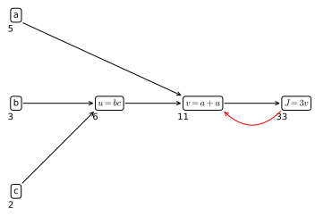
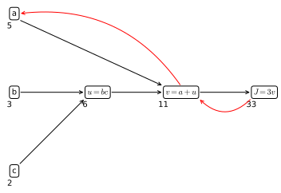

# Derivatives and computation graph
Derivatives are a fundamental concept in machine learning, they are the building block of optimization and having an understanding of what a derivative is vastly helps in understanding how optimization and gradient descent work.

## Derivative
Suppose we have a function $f(a) = 3a$, then $f(2) = 6$. If we take a small increment of $a$ ($a'$) we will have $f(2.001) = 6.003$. Connecting $a$ and $a'$ forms a triangle, with an height ($a'-a$) and a width ($f(a') - f(a)$) (<a href="#fig:derivative">Figure 5</a>).

The slope $\frac{\text{height} }{\text{width}}=3$ so we say that the derivative of $f(a)$ at the point $a=2$ is $3$. Height and width are the the vertical and horizontal distances and the slope is also expressed as $\frac{df(a)}{da}$ or as $\frac{d}{da}f(a)$. The reason why $a'$ doesn't appear in this representation is because, formally, the derivative is calculated at a very small increment of $a$ such as $a' \approx a$.

For a straight line (<a href="#fig:derivative">Figure 5</a>, panel A) the derivative is constant along the whole line.


    

<figure id="fig:derivative">
    
    <figcaption>Figure 5. The concept of derivative applied to a straight line (A), where the derivative is constant along the whole length of the function; and to a non-linear function (B), where the derivative changes based on the value of $a$.</figcaption>
</figure>

## Computational graph
The computational graph explains the forward- and backward- propagation (as to say the flow of the computation) that takes place in the training of a neural network. 

To illustrate the computation graph let's use a simpler example than a full blown neural network, let's say that we are writing a function $J(a, b, c) = 3(a+bc)$. In order to compute this function there are three steps: 

1. $u = bc$
2. $v = a + u$
3. $J=3v$

We can draw these steps in a computational graph (<a href="#compgraph">figure below</a>)


    <mpl_flow.Edge at 0x7fea6f1cf550>


    

<figure id="compgraph">
    
    <figcaption>Figure 6. Computational graph showing the flow of a very simple process</figcaption>
</figure>

Suppose we want to calculate $\frac{dJ}{dv}$ ( in other words if we change the value $v$ of a little amount how would the value of $J$ change?). 

* $J = 3v$
* $v = 11 \to 3.001$
* $J = 33 \to 33.003$

So 

$$\frac{dJ}{dv}=\frac{0.003}{0.001}=3$$

In the terminology of backpropagation if we want to compute $\frac{dJ}{dv}$ we take one step back from $J$ to $v$


    <mpl_flow.Edge at 0x7fea6f1449a0>


    

    


We now want to calculate $\frac{dJ}{da}$, in other words the change of value $J$ when $a$ changes

* $a = 5 \to 5.001$
* $v = 11 \to 11.001$
* $J = 33 \to 33.003$

So, once again

$$\frac{dJ}{da}=\frac{0.003}{0.001}=3$$

Where the net change is given by 

$$
\frac{dJ}{da}=\frac{dJ}{dv}\frac{dv}{da}
$$


In calculus this is called the **chain rule** where $a$ affects $v$ that affects $J$ ($a\to v \to J$). So that the change of $J$ when $a$ is given by the product $\frac{dJ}{dv}\frac{dv}{da}$. This illustrates how having computed $\frac{dJ}{dv}$ helps in calculating $\frac{dJ}{da}$


    <mpl_flow.Edge at 0x7fea6f0d20a0>


    

    


# Python vectorization
In the pre-deep-learning era vectorization was optional, in the deep-learning era vectorization absolutely necessary since both the size of networks and of data is vastly increased.

## Vector-vector product
In particular, in deep learning (and in machine learning in general) we need to calculate 

$$
z = w^Tx+b
$$

for 

$$
w =
\begin{bmatrix}
\vdots \\ \vdots
\end{bmatrix} \in \mathbb{R}^{n_x}
\qquad 
x = \begin{bmatrix}
\vdots \\ \vdots
\end{bmatrix} \in \mathbb{R}^{n_x}
$$

The vectorized form of this operation in python is 



```python
np.dot(w, x) + b
```

where `np.dot(w, x)` $\equiv w^Tx$

## Matrix-vector product
Incidentally, the matrix-vector product $Av$, where 

$$
A = \begin{bmatrix}
\ddots &  \\
&   \\
&  \ddots \\
\end{bmatrix} \in \mathbb{R}^{m \times n} \qquad 
v=\begin{bmatrix}
\vdots \\ \vdots
\end{bmatrix} \in \mathbb{R}^n
$$



```python
np.dot(A, v)
```

Notice that the exact same syntax performs both vecto-vector and matrix-vector multiplication, this is due to the overload implemented in the `np.dot` function. To know more about it, check out [its documentation](https://numpy.org/doc/stable/reference/generated/numpy.dot.html)

## Vectorized element-wise operations
To apply a function element by element to whole arrays you can simply use`np.ufuncs` ([numpy universal functions](https://numpy.org/doc/stable/reference/generated/numpy.ufunc.html#numpy.ufunc))



```python
v
```


    array([0.17, 0.64, 0.46, 0.08, 0.26, 0.62, 0.56, 0.75, 0.03, 0.48])



```python
np.exp(v).round(2)
```


    array([1.19, 1.9 , 1.58, 1.08, 1.3 , 1.86, 1.75, 2.12, 1.03, 1.62])



```python
np.log(v).round(2)
```


    array([-1.77, -0.45, -0.78, -2.53, -1.35, -0.48, -0.58, -0.29, -3.51,
           -0.73])



```python
v + 1
```


    array([1.17, 1.64, 1.46, 1.08, 1.26, 1.62, 1.56, 1.75, 1.03, 1.48])



```python
v * 2
```


    array([0.34, 1.28, 0.92, 0.16, 0.52, 1.24, 1.12, 1.5 , 0.06, 0.96])


## Broadcasting
To a complete guide to broadcasting check out [numpy great documentation](https://numpy.org/doc/stable/user/basics.broadcasting.html#:~:text=The%20term%20broadcasting%20describes%20how,that%20they%20have%20compatible%20shapes.&text=NumPy%20operations%20are%20usually%20done,element%2Dby%2Delement%20basis.)


<div>
<style scoped>
    .dataframe tbody tr th:only-of-type {
        vertical-align: middle;
    }

    .dataframe tbody tr th {
        vertical-align: top;
    }

    .dataframe thead th {
        text-align: right;
    }
</style>
<table border="1" class="dataframe">
  <thead>
    <tr style="text-align: right;">
      <th></th>
      <th>Apples</th>
      <th>Beef</th>
      <th>Eggs</th>
      <th>Potatoes</th>
    </tr>
  </thead>
  <tbody>
    <tr>
      <th>Carb</th>
      <td>56.0</td>
      <td>0</td>
      <td>4.4</td>
      <td>6.8</td>
    </tr>
    <tr>
      <th>Protein</th>
      <td>1.2</td>
      <td>104</td>
      <td>52.0</td>
      <td>8.0</td>
    </tr>
    <tr>
      <th>Fat</th>
      <td>1.8</td>
      <td>135</td>
      <td>99.0</td>
      <td>0.9</td>
    </tr>
  </tbody>
</table>
</div>



```python
A = A.values
A
```


    array([[ 56. ,   0. ,   4.4,   6.8],
           [  1.2, 104. ,  52. ,   8. ],
           [  1.8, 135. ,  99. ,   0.9]])



```python
cal = A.sum(axis=0)
cal
```


    array([ 59. , 239. , 155.4,  15.7])



```python
(A / cal.reshape(1, 4) * 100)
```


    array([[94.91525424,  0.        ,  2.83140283, 43.31210191],
           [ 2.03389831, 43.51464435, 33.46203346, 50.95541401],
           [ 3.05084746, 56.48535565, 63.70656371,  5.73248408]])



```python
A / cal * 100
```


    array([[94.91525424,  0.        ,  2.83140283, 43.31210191],
           [ 2.03389831, 43.51464435, 33.46203346, 50.95541401],
           [ 3.05084746, 56.48535565, 63.70656371,  5.73248408]])


In general if you have a $m, n$ matrix (A) 

* if you apply an operation with an $1, n$ matrix (B), then B will be copied $m$ times and the operations applied element-wise
* if you apply an operation with an $m, 1$ matrix (C), then C will be copied $n$ times and the operations applied element-wise

## numpy Vectors
`numpy` offers great flexibility at the cost of rigorousness, sometimes wrong-looking expression give unexpectedly correct results and vice versa.
Heres a series of considerations and suggestions for dealing with `numpy`.

For example let's take a random vector of 5 elements



```python
a = np.random.rand(5)
a
```


    array([0.69772688, 0.83113936, 0.58433493, 0.2092702 , 0.70983487])


Whose shape is



```python
a.shape
```


    (5,)


This is called a rank 1 vector in python and it's neither a row vector nor a column vector and its behavior is sometimes unexpected. 

For example, its transpose is equal to itself 



```python
a.T
```


    array([0.69772688, 0.83113936, 0.58433493, 0.2092702 , 0.70983487])


and the inner product of `a` and `a.T` is not a matrix instead is a scalar



```python
np.dot(a, a.T)
```


    2.0667222923715833


So, instead of using rank 1 vectors you may want to use rank 2 vectors, which have a much more predictable behavior.



```python
a = np.random.rand(5, 1)
a
```


    array([[0.59830775],
           [0.41295833],
           [0.94338306],
           [0.16903855],
           [0.66591253]])



```python
a.T
```


    array([[0.59830775, 0.41295833, 0.94338306, 0.16903855, 0.66591253]])



```python
np.dot(a, a.T)
```


    array([[0.35797216, 0.24707617, 0.56443339, 0.10113708, 0.39842062],
           [0.24707617, 0.17053458, 0.38957789, 0.06980588, 0.27499412],
           [0.56443339, 0.38957789, 0.88997159, 0.15946811, 0.62821059],
           [0.10113708, 0.06980588, 0.15946811, 0.02857403, 0.11256489],
           [0.39842062, 0.27499412, 0.62821059, 0.11256489, 0.44343949]])


rank 1 arrays can always be reshaped in row or columns vectors (or higher dimensional matrices)



```python
a = np.random.rand(5)
a
```


    array([0.02657882, 0.91282618, 0.91845211, 0.64890572, 0.40281761])



```python
a.reshape(5, 1)
```


    array([[0.02657882],
           [0.91282618],
           [0.91845211],
           [0.64890572],
           [0.40281761]])



```python
a.reshape(1, 5)
```


    array([[0.02657882, 0.91282618, 0.91845211, 0.64890572, 0.40281761]])


