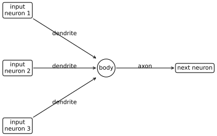
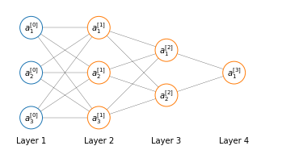

# Model Representation of Neural Network
Anatomical neurons are cells that are present in the brain in millions. A neuron has a cell body, a number of input wires, called *dendrites* and an output wire called *axon*.


    

    


In a simplistic way a neuron is a computational unit that receive some input via dendrites, does some computation and then outputs something via the axon to other neurons in the brain.

A neuron implemented on the computer has a very simple model that mimics the architecture of an anatomical neuron. We're a going to model a neuron as just a logistic unit. The yellow node represents the *body* of the neuron, which is fed input through its *dendrites*, and produces an output $h_\theta(x)$ that is produced by the neuron body, though its **activation function** and transported forward by the neuron *axon*. Where $h_\theta(x)=\frac{1}{1+e^{-\theta^Tx}}$


    

    


A simpler representation is sometimes used to depict a neural network

$$
[x_0x_1x_2x_3]\to[]\to h_\theta(x)
$$

where $x_0$ (sometimes called the bias unit) is usually omitted in favor of another representation:

$$
[x_1x_2x_3]\to[]\to h_\theta(x)
$$

and the parameters, or **weights** ($w$) are accompanied by the **bias** $b$.

Until now we represented single neurons; a neural network is a group of different neurons connected together. The input nodes are grouped in what is called the **input layer** ($x$), which is always the first layer of the neural network. The final layer is called the **output layer**, since it computes the final value of our hypothesis. And all layers in between the input and the output layers are called **hidden layers**. They are called hidden layers because we can't observes the values computed by these nodes.


    

<figure id="simpleann">
    
    <figcaption>Figure 5. A simple neural network with one hidden layer</figcaption>
</figure>

The computational entities in a neural networks are:

* $a_i^{[j]}$  activation neuron/unit $i$ in layer $j$
* $W^{[j]}$ matrix of weights controlling the function mapping from layer $j$ to layer $j+1$ 
* $b^{[j]}$ the bias vectors

And the computation in the network

$$
\left[x_1 x_2 x_3 \right]\to \left[a_1^{[1]}a_2^{[1]}a_3^{[1]} \right]\to a_1^{[2]} \equiv \hat{y}
$$

# Forward propagation

The flow of the computation in the network in <a href="#simpleann">Figure 5</a> from input (left) to prediction (right), called forward propagation, is just like that in logistic regression but a lot more times. In fact, each unit in layer $j$ is **densely connected** (namely is connected to all units in layer $j+1$) and we will have to compute a logistic regression for each connection.

So, for example, the computations that we will have to execute from the input layer to the first layer will be:

$$
\begin{align}
& a_1^{[1]} =
g \left(
\left( W_{11}^{[1]}x_1 + b^{[1]}_{11} \right) + 
\left( W_{12}^{[1]}x_2 + b^{[1]}_{12} \right) +
\left( W_{13}^{[1]}x_3 + b^{[1]}_{13} \right)
\right) \\
& a_2^{[1]} = 
g \left(
\left( W_{21}^{[1]}x_1 + b^{[1]}_{21} \right) + 
\left( W_{22}^{[1]}x_2 + b^{[1]}_{22} \right) +
\left( W_{23}^{[1]}x_3 + b^{[1]}_{23} \right)
\right) \\
& a_3^{[1]} = 
g \left(
\left( W_{31}^{[1]}x_1 + b^{[1]}_{31} \right) + 
\left( W_{32}^{[1]}x_2 + b^{[1]}_{32} \right) +
\left( W_{33}^{[1]}x_3 + b^{[1]}_{33} \right)
\right) \\
\end{align}
\label{eq:neuralnet} \tag{1}
$$

That is to say that we compute our hidden units in the first layer as a $3\times 4$ matrix of parameters $W^{[j]}_{ik}$, weighting the connection from unit $k$ in layer $j-1$ to unit $i$ in layer $j$.


<div>
<style scoped>
    .dataframe tbody tr th:only-of-type {
        vertical-align: middle;
    }

    .dataframe tbody tr th {
        vertical-align: top;
    }

    .dataframe thead th {
        text-align: right;
    }
</style>
<table border="1" class="dataframe">
  <thead>
    <tr style="text-align: right;">
      <th></th>
      <th>$x_1$</th>
      <th>$x_2$</th>
      <th>$x_3$</th>
    </tr>
  </thead>
  <tbody>
    <tr>
      <th>$a^{[1]}_1$</th>
      <td>$W^{[1]}_{11}$</td>
      <td>$W^{[1]}_{12}$</td>
      <td>$W^{[1]}_{13}$</td>
    </tr>
    <tr>
      <th>$a^{[1]}_2$</th>
      <td>$W^{[1]}_{21}$</td>
      <td>$W^{[1]}_{22}$</td>
      <td>$W^{[1]}_{23}$</td>
    </tr>
    <tr>
      <th>$a^{[1]}_3$</th>
      <td>$W^{[1]}_{31}$</td>
      <td>$W^{[1]}_{32}$</td>
      <td>$W^{[1]}_{33}$</td>
    </tr>
  </tbody>
</table>
</div>


## Vectorization
Let's rewrite the argument of the functions $g$ in $\eqref{eq:neuralnet}$ as $z^{[j]}$ so that now we have

$$
\begin{align}
& a_1^{[1]} = g \left(z_1^{[1]}\right) \\
& a_2^{[1]} = g \left(z_2^{[1]}\right) \\
& a_3^{[1]} = g \left(z_3^{[1]}\right)
\end{align}
$$

Looking at $\eqref{eq:neuralnet}$ again, we can see that the way the arguments of $g$ in $a_1^{[1]}, a_2^{[1]}, a_2^{[1]}$ are disposed can be written as $W^{[1]}x$, where $x$ is a vector of inputs.

$$
\begin{split}
x=
\begin{bmatrix}
x_1\\
x_2\\
x_3
\end{bmatrix}
\end{split}
\qquad
\begin{split}
z^{[1]}=
\begin{bmatrix}
z_1^{[1]}\\
z_2^{[1]}\\
z_3^{[1]}
\end{bmatrix}
\qquad
a^{[1]}=
\begin{bmatrix}
a_1^{[1]}\\
a_2^{[1]}\\
a_3^{[1]}
\end{bmatrix}
\end{split}
$$

$$
\begin{align}
&z^{[1]}=W^{[1]}x +b^{[1]}\\
&a^{[1]}=g\left(z^{[1]}\right)
\end{align}
$$

Where $a^{[1]}$ and $z^{[1]}$ are $\mathbb{R}^3$ vectors. Now we could say that the input layer is also an activation layer and call it $a^{[0]}$ so that

$$
z^{[1]}=W^{[1]}a^{[0]} + b^{[1]}
$$

What we have written so far give us the value for $ a^{[1]}_1, a^{[1]}_2, a^{[1]}_3 $.

We can now compute $\hat{y} \eqref{eq:neuralnet_h}$

$$
\begin{align}
&z^{[2]}=W^{[2]}a^{[1]} + v^{[2]} \\
&\hat{y}=a^{[2]} = g\left(z^{[2]}\right)
\end{align}
$$

or more generally

$$
\begin{align}
&z^{[j]}=W^{[j]}a^{[j-1]} + b^{[j]} \\
&\hat{y}=a^{[j]} = g\left(z^{[j]}\right)
\end{align}
$$


This process is called **forward propagation**

# Neural networks learn their own features
Let's take the network used as example above and focus on the last two layers


    

    


What is left in this neural network is simply logistic regeression, where we use the output unit (or logistic regression unit) to build the hypothesis $\hat{y}$

$$
\hat{y} = \sigma \left(w_{10}^{[2]}a_0^{[1]}+w_{11}^{[2]}a_1^{[1]}+w_{12}^{[2]}a_2^{[1]}+ w_{13}^{[2]}a_3^{[1]} \right)
$$

Where the features fed into logistic regression are the values in $a^{[1]}$. And here resides the fundamental difference between neural networks and logistic regression: the features $A^{[1]}$ they themselves are learned as functions of the input $x$ with some other set of parameters $W^{[1]}$

The neural network, instead of being constrained to feed the features $x$ to logistic regression, learns its own features $A^{[1]}$ to feed into logistic regression. Depending on the parameters $W^{[1]}$, it can learn some complex features and result in a better hypothesis that you could have if you were constrained to use features $x$ or even if you had to manually set some higher order polynomial features combining the features $x$.

Neural networks can have different number and dimension of hidden layers and the way a neural network is connected is called its **architecture**.


    

    


## Vectorization
<a href="#simpleann">Figure 5</a> is described by the set of equations:

$$
\begin{aligned}
&z^{[1]}= W^{[1]}x + b^{[1]} \\
&a^{[1]} = \sigma(z^{[1]})\\
&z^{[2]}= W^{[1]}a^{[1]} + b^{[2]}\\
&a^{[2]} = \sigma(z^{[2]})\\
\end{aligned}
$$

This process must be repeated for each training example $x^{(n)}$ and will produce $n$ outputs $a^{[2](n)} = \hat{y}^{(n)}$

In a non-vectorized implementation you would have something along the lines of:

```python
for i in len(examples):
    z[1][i] = w[1] @ x(i) + b[i]
    a[1][i] = sigmoid(z[1][i])
    z[2][i] = w[2] @ x(i) + b[i]
    a[2][i] = sigmoid(z[2][i])
```

Given our vector of training examples:

$$
X=
\begin{bmatrix}
&\vdots&\vdots&&\vdots\\
&x^{(1)}&x^{(2)}&\dots&x^{(m)}\\
&\vdots&\vdots&&\vdots\\
\end{bmatrix} \in \mathbb{R}^{n\times m}
$$

So this means that our vectorized implementation becomes

$$
\begin{aligned}
&Z^{[1]}= W^{[1]}X + b^{[1]} \\
&A^{[1]} = \sigma(z^{[1]})\\
&Z^{[2]}= W^{[2]}A^{[1]} + b^{[2]}\\
&A^{[2]} = \sigma(Z^{[2]})\\
\end{aligned}
$$

with $Z^{[1]}$ and $A^{[1]}$ represent the $z$-values and $a$-values of the first layer of the neural network:

$$
Z^{[1]}=
\begin{bmatrix}
&\vdots&\vdots&&\vdots\\
&z^{[1](1)}&z^{[1](2)}&\dots&z^{[1](m)}\\
&\vdots&\vdots&&\vdots\\
\end{bmatrix} \in \mathbb{R}^{n^{[1]} \times m} 
\qquad 
A^{[1]}=
\begin{bmatrix}
&\vdots&\vdots&&\vdots\\
&a^{[1](1)}&a^{[1](2)}&\dots&a^{[1](m)}\\
&\vdots&\vdots&&\vdots\\
\end{bmatrix} \in \mathbb{R}^{n^{[1]} \times m}
$$

where $m$ is the number of training examples and $n^{[1]}$ is the number of nodes (hidden units) in the first layer of the neural networks.
