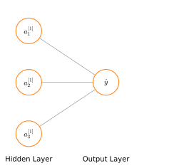
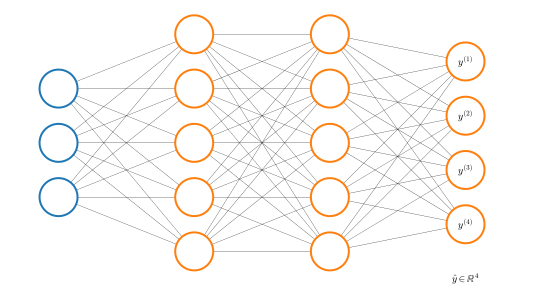

# Neural networks learn their own features
Let's take the network <a href="ML10#simpleann">the previous lesson</a> and focus on the last two layers

    

    

What is left in this neural network is simply logistic regeression, where we use the output unit (or logistic regression unit) to build the hypothesis $\hat{y}$

$$
\hat{y} = \sigma \left(w_{10}^{[2]}a_0^{[1]}+w_{11}^{[2]}a_1^{[1]}+w_{12}^{[2]}a_2^{[1]}+ w_{13}^{[2]}a_3^{[1]} \right)
$$

Where the features fed into logistic regression are the values in $a^{[1]}$. And here resides the fundamental difference between neural networks and logistic regression: the features $A^{[1]}$ they themselves are learned as functions of the input $x$ with some other set of parameters $W^{[1]}$

The neural network, instead of being constrained to feed the features $x$ to logistic regression, learns its own features $A^{[1]}$ to feed into logistic regression. Depending on the parameters $W^{[1]}$, it can learn some complex features and result in a better hypothesis that you could have if you were constrained to use features $x$ or even if you had to manually set some higher order polynomial features combining the features $x$.

Neural networks can have different number and dimension of hidden layers and the way a neural network is connected is called its **architecture**.

    

    

# How neural networks build complex non-linear functions
In this section we will explain how a neural network can build relatively complex non-linear functions.

Let's take a non-linear classification example like that depicted below, where panel A is just a simplified version of panel B.

    

    

This is a non-linear classification example modeled by the logical XNOR function

$$
\begin{align}
&x_1 \; \text{XNOR} \; x_2 \\
&\text{NOT} \; (x_1 \; \text{XOR} \; x_2)
\end{align}
$$

## Logical AND function
Let's look at a neural network that can calculate the logical $\text{AND}$ function.

$$
\begin{align}
&x_1,x_2\in \lbrace 0,1 \rbrace\\
&y= x_1 \wedge x_2\\
&W^{[1]} = 
\begin{bmatrix}-30\\20\\20\end{bmatrix}
\end{align}
$$

    

    

So that 

$$
\begin{equation}
\hat{y} = \sigma(-30+20x_1+20x_2)
\end{equation}
\label{eq:h} \tag{1}
$$

Since the sigmoid activation function $\sigma(z)$ is

    

    

The the output of $\eqref{eq:h}$ is

<table id="T_81c33_">
  <thead>
    <tr>
      <th class="col_heading level0 col0" >$x_1$</th>
      <th class="col_heading level0 col1" >$x_2$</th>
      <th class="col_heading level0 col2" >$\hat{y}$</th>
    </tr>
  </thead>
  <tbody>
    <tr>
      <td id="T_81c33_row0_col0" class="data row0 col0" >0</td>
      <td id="T_81c33_row0_col1" class="data row0 col1" >0</td>
      <td id="T_81c33_row0_col2" class="data row0 col2" >$\sigma(-30) \approx 0$</td>
    </tr>
    <tr>
      <td id="T_81c33_row1_col0" class="data row1 col0" >0</td>
      <td id="T_81c33_row1_col1" class="data row1 col1" >1</td>
      <td id="T_81c33_row1_col2" class="data row1 col2" >$\sigma(-10) \approx 0$</td>
    </tr>
    <tr>
      <td id="T_81c33_row2_col0" class="data row2 col0" >1</td>
      <td id="T_81c33_row2_col1" class="data row2 col1" >0</td>
      <td id="T_81c33_row2_col2" class="data row2 col2" >$\sigma(-10) \approx 0$</td>
    </tr>
    <tr>
      <td id="T_81c33_row3_col0" class="data row3 col0" >1</td>
      <td id="T_81c33_row3_col1" class="data row3 col1" >1</td>
      <td id="T_81c33_row3_col2" class="data row3 col2" >$\sigma(10) \approx 1$</td>
    </tr>
  </tbody>
</table>

Which is exactly the $x_1 \wedge x_2$.

## Logical OR function
The following network and table show instead $x_1 \vee x_2$

    

    

$$\hat{y} = \sigma(-10+20x_1+20x_2)$$

<table id="T_73e86_">
  <thead>
    <tr>
      <th class="col_heading level0 col0" >$x_1$</th>
      <th class="col_heading level0 col1" >$x_2$</th>
      <th class="col_heading level0 col2" >$\hat{y}$</th>
    </tr>
  </thead>
  <tbody>
    <tr>
      <td id="T_73e86_row0_col0" class="data row0 col0" >0</td>
      <td id="T_73e86_row0_col1" class="data row0 col1" >0</td>
      <td id="T_73e86_row0_col2" class="data row0 col2" >$\sigma(-10) \approx 0$</td>
    </tr>
    <tr>
      <td id="T_73e86_row1_col0" class="data row1 col0" >0</td>
      <td id="T_73e86_row1_col1" class="data row1 col1" >1</td>
      <td id="T_73e86_row1_col2" class="data row1 col2" >$\sigma(10) \approx 1$</td>
    </tr>
    <tr>
      <td id="T_73e86_row2_col0" class="data row2 col0" >1</td>
      <td id="T_73e86_row2_col1" class="data row2 col1" >0</td>
      <td id="T_73e86_row2_col2" class="data row2 col2" >$\sigma(10) \approx 1$</td>
    </tr>
    <tr>
      <td id="T_73e86_row3_col0" class="data row3 col0" >1</td>
      <td id="T_73e86_row3_col1" class="data row3 col1" >1</td>
      <td id="T_73e86_row3_col2" class="data row3 col2" >$\sigma(30) \approx 1$</td>
    </tr>
  </tbody>
</table>

## Logical NOT function

    

    

<table id="T_7a88d_">
  <thead>
    <tr>
      <th class="col_heading level0 col0" >$x_1$</th>
      <th class="col_heading level0 col1" >$\hat{y}$</th>
    </tr>
  </thead>
  <tbody>
    <tr>
      <td id="T_7a88d_row0_col0" class="data row0 col0" >0</td>
      <td id="T_7a88d_row0_col1" class="data row0 col1" >$\sigma(10) \approx 1$</td>
    </tr>
    <tr>
      <td id="T_7a88d_row1_col0" class="data row1 col0" >1</td>
      <td id="T_7a88d_row1_col1" class="data row1 col1" >$\sigma(-10) \approx 0$</td>
    </tr>
  </tbody>
</table>

## Logical NOT-1 AND NOT-2 function

    

    

<table id="T_985d0_">
  <thead>
    <tr>
      <th class="col_heading level0 col0" >$x_1$</th>
      <th class="col_heading level0 col1" >$x_2$</th>
      <th class="col_heading level0 col2" >$\hat{y}$</th>
    </tr>
  </thead>
  <tbody>
    <tr>
      <td id="T_985d0_row0_col0" class="data row0 col0" >0</td>
      <td id="T_985d0_row0_col1" class="data row0 col1" >0</td>
      <td id="T_985d0_row0_col2" class="data row0 col2" >$\sigma(10) \approx 1$</td>
    </tr>
    <tr>
      <td id="T_985d0_row1_col0" class="data row1 col0" >0</td>
      <td id="T_985d0_row1_col1" class="data row1 col1" >1</td>
      <td id="T_985d0_row1_col2" class="data row1 col2" >$\sigma(-10) \approx 0$</td>
    </tr>
    <tr>
      <td id="T_985d0_row2_col0" class="data row2 col0" >1</td>
      <td id="T_985d0_row2_col1" class="data row2 col1" >0</td>
      <td id="T_985d0_row2_col2" class="data row2 col2" >$\sigma(-10) \approx 0$</td>
    </tr>
    <tr>
      <td id="T_985d0_row3_col0" class="data row3 col0" >1</td>
      <td id="T_985d0_row3_col1" class="data row3 col1" >1</td>
      <td id="T_985d0_row3_col2" class="data row3 col2" >$\sigma(-30) \approx 0$</td>
    </tr>
  </tbody>
</table>

## Logical XNOR function

    

    

    

    

<table id="T_6f2ef_">
  <thead>
    <tr>
      <th class="col_heading level0 col0" >$x_1$</th>
      <th class="col_heading level0 col1" >$x_2$</th>
      <th class="col_heading level0 col2" >$a_1^{[1]}$</th>
      <th class="col_heading level0 col3" >$a_2^{[1]}$</th>
      <th class="col_heading level0 col4" >$\hat{y}$</th>
    </tr>
  </thead>
  <tbody>
    <tr>
      <td id="T_6f2ef_row0_col0" class="data row0 col0" >0</td>
      <td id="T_6f2ef_row0_col1" class="data row0 col1" >0</td>
      <td id="T_6f2ef_row0_col2" class="data row0 col2" >0</td>
      <td id="T_6f2ef_row0_col3" class="data row0 col3" >1</td>
      <td id="T_6f2ef_row0_col4" class="data row0 col4" >1</td>
    </tr>
    <tr>
      <td id="T_6f2ef_row1_col0" class="data row1 col0" >0</td>
      <td id="T_6f2ef_row1_col1" class="data row1 col1" >1</td>
      <td id="T_6f2ef_row1_col2" class="data row1 col2" >0</td>
      <td id="T_6f2ef_row1_col3" class="data row1 col3" >0</td>
      <td id="T_6f2ef_row1_col4" class="data row1 col4" >0</td>
    </tr>
    <tr>
      <td id="T_6f2ef_row2_col0" class="data row2 col0" >1</td>
      <td id="T_6f2ef_row2_col1" class="data row2 col1" >0</td>
      <td id="T_6f2ef_row2_col2" class="data row2 col2" >0</td>
      <td id="T_6f2ef_row2_col3" class="data row2 col3" >0</td>
      <td id="T_6f2ef_row2_col4" class="data row2 col4" >0</td>
    </tr>
    <tr>
      <td id="T_6f2ef_row3_col0" class="data row3 col0" >1</td>
      <td id="T_6f2ef_row3_col1" class="data row3 col1" >1</td>
      <td id="T_6f2ef_row3_col2" class="data row3 col2" >1</td>
      <td id="T_6f2ef_row3_col3" class="data row3 col3" >0</td>
      <td id="T_6f2ef_row3_col4" class="data row3 col4" >1</td>
    </tr>
  </tbody>
</table>

# Neural network multi-class classification
Multiclass classification in neural network is an extension of the on vs all method. Let's say that we want to build an image processing algorithm that can distinguish between four class of vehicles. We will build a neural network with 4 output units, each of which will model one of the output classes $C$

$$
h\Theta(x) = \begin{bmatrix}
P(y_1 \mid x, \Theta) \\
P(y_2 \mid x, \Theta) \\
P(y_3 \mid x, \Theta)\\
P(y_4 \mid x, \Theta)
\end{bmatrix}
$$

    

    

So that $\hat{y}_i$ can be one of the following

$$\hat{y}_i \approx \begin{bmatrix}1\\0\\0\\0\end{bmatrix} \;, \;  \begin{bmatrix}0\\1\\0\\0\end{bmatrix} \;, \;  \begin{bmatrix}0\\0\\1\\0\end{bmatrix}
\;, \;  \begin{bmatrix}0\\0\\0\\1\end{bmatrix}$$

