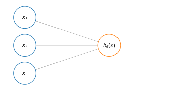
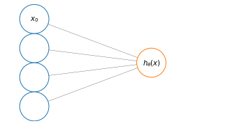
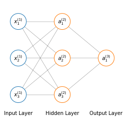
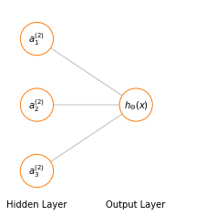
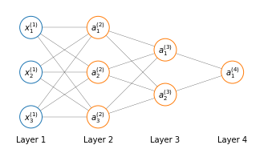

# Model Representation of Neural Network
Anatomical neurons are cells that are present in the brain in millions. A neuron has a cell body, a number of input wires, called *dendrites* and an output wire called *axon*.


In a simplistic way a neuron is a computational unit that receive some input via dendrites, does some computation and then outputs something via the axon to other neurons in the brain.

A neuron implemented on the computer has a very simple model that mimics the architecture of an anatomical neuron. We're a going to model a neuron as just a logistic unit. The yellow node represents the *body* of the neuron, which is fed input through its *dendrites*, and produces an output $h_\theta(x)$ that is produced by the neuron body, though its **activation function** and transported forward by the neuron *axon*. Where $h_\theta(x)=\frac{1}{1+e^{-\theta^Tx}}$





A simpler representation is sometimes used to depict a neural network

$$
[x_0x_1x_2x_3]\to[]\to h_\theta(x)
$$

Sometimes when representing the inputs of a neuron the $x_0$, which is sometimes called the bias unit (since $x_0=1$), might be added if it convenient for the discussion of the model.





In neural networks the parameters $\theta$ of the model are sometimes called **weights**.

Until now we represented single neurons; a neural network is a group of different neurons connected together. The input nodes are grouped in what is called the **input layer**, which is always the first layer of the neural network. The final layer is called the **output layer**, since it computes the final value of our hypothesis. And all layers in between the input and the output layers are called **hidden layers**. They are called hidden layers because we can't observes the values computed by these nodes.





The computational entities in a neural networks are:

* $a_i^{(j)}$  activation neuron/unit $i$ in layer $j$
* $\Theta^{(j)}$ matrix of weights controlling the function mapping from layer $j$ to layer $j+1$ 

And the computation in the network

$$
[x_0x_1x_2x_3]\to \left[a_1^{(2)}a_2^{(2)}a_3^{(2)} \right]\to h_\Theta(x)
$$

depicted in the figure above, is

$$
\begin{align}
& a_1^{(2)} = g \left(\Theta_{10}^{(1)}x_0 + \Theta_{11}^{(1)}x_1 + \Theta_{12}^{(1)}x_2 + \Theta_{13}^{(1)}x_3\right) \\
& a_2^{(2)} = g \left(\Theta_{20}^{(1)}x_0 + \Theta_{21}^{(1)}x_1 + \Theta_{22}^{(1)}x_2 + \Theta_{23}^{(1)}x_3\right) \\
& a_3^{(2)} = g \left(\Theta_{30}^{(1)}x_0 + \Theta_{31}^{(1)}x_1 + \Theta_{32}^{(1)}x_2 + \Theta_{33}^{(1)}x_3\right)
\end{align}
\label{eq:neuralnet} \tag{1}
$$


$$
h_\Theta(x)= a_1^{(3)} =  \left(\Theta_{10}^{(2)}a_0^{(2)} + \Theta_{11}^{(1)}a_1^{(2)} + \Theta_{12}^{(2)}a_2^{(2)} + \Theta_{13}^{(2)}a_3^{(2)}\right)
\label{eq:neuralnet_h} \tag{2}
$$

So in this network we have 3 input units and 3 hidden units and so the dimension of $\Theta^{(1)}$, which is the matrix of parameters weighting the values from the 3 input units from the 3 hidden units is going to be $\Theta^{(1)} \in \mathbb{R} ^{3\times4}$.

In general if a network has $s_j$ units in layer $j$, $s_{j+1}$ units in layer $j+1$, then $\Theta^{(j)}$ will be of dimension $s_{j+1} \times (s_j+1)$

# Forward propagation

Let's rewrite the argument of the functions $g$ in $\eqref{eq:neuralnet}$ as $z^{(j)}$ so that now we have

$$
\begin{align}
& a_1^{(2)} = g \left(z_1^{(2)}\right) \\
& a_2^{(2)} = g \left(z_2^{(2)}\right) \\
& a_3^{(2)} = g \left(z_3^{(2)}\right)
\end{align}
$$

Looking at $\eqref{eq:neuralnet}$ again, we can see that the way the arguments of $g$ in $a_1^{(2)}, a_2^{(2)}, a_2^{(2)}$ are disposed can be written as $\Theta^{(1)}x$, where $x$ is a vector of inputs.

$$
\begin{split}
x=
\begin{bmatrix}
x_0\\
x_1\\
x_2\\
x_3
\end{bmatrix}
\end{split}
\quad\quad\quad
\begin{split}
z^{(2)}=
\begin{bmatrix}
z_1^{(2)}\\
z_2^{(2)}\\
z_3^{(2)}
\end{bmatrix}
\end{split}
$$

$$
\begin{align}
&z^{(2)}=\Theta^{(1)}x \\
&a^{(2)}=g\left(z^{(2)}\right)
\end{align}
$$

Where $a^{(2)}$ and $z^{(2)}$ are $\mathbb{R}^3$ vectors. Now we could say that the input layer is also an activation layer and call it $a^{(1)}$ so that

$$
z^{(2)}=\Theta^{(1)}a^{(1)}
$$

What we have written so far give us the value for $ a^{(2)}_1, a^{(2)}_2, a^{(2)}_3 $.

If we look at $ \eqref{eq:neuralnet_h} $ we see that we need one more value, the bias unit $a^{(2)}_{0} = 1$ that we need to add to $a^{(2)}$, which becomes a $\mathbb{R}^4$ vector

$$
a^{(2)}=
\begin{bmatrix}
a_0^{(2)}\\
a_1^{(2)}\\
a_2^{(2)}\\
a_3^{(2)}
\end{bmatrix}
$$

We can now compute $h_\Theta(x)$ $\eqref{eq:neuralnet_h}$

$$
\begin{align}
&z^{(3)}=\Theta^{(2)}a^{(2)} \\
&h_\Theta(x)=a^{(3)} = g\left(z^{(3)}\right)
\end{align}
$$

or more generally

$$
\begin{align}
&z^{(j+1)}=\Theta^{(j)}a^{(j)} \\
&h_\Theta(x)=a^{(j+1)} = g\left(z^{(j+1)}\right)
\end{align}
$$


This process is called **forward propagation**

# Neural networks learn its own features
Let's take the network used as example above and focus on the last two layers





What is left in this neural network is simply logistic regeression, where we use the output unit (or logistic regression unit) to build the hypothesis $h_\Theta(x)$

$$
h_\Theta(x) = g\left(\Theta_{10}^{(2)}a_0^{(2)}+\Theta_{11}^{(2)}a_1^{(2)}+\Theta_{12}^{(2)}a_2^{(2)}+ \Theta_{13}^{(2)}a_3^{(2)} \right)
$$

Where the features fed into logistic regression are the values in $a^{(2)}$. And here resides the fundamental difference between neural networks and logistic regression: the features $a^{(2)}$ they themselves are learned as functions of the input $x$ with some other set of parameters $\Theta^{(1)}$

The neural network, instead of being constrained to feed the features $x$ to logistic regression, learns its own features $a^{(2)}$ to feed into logistic regression. Depending on the parameters $\Theta^{(1)}$, it can learn some complex features and result in a better hypothesis that you could have if you were constrained to use features $x$ or even if you had to manually set some higher order polynomial features combining the features $x$.

Neural networks can have different number and dimension of hidden layers and the way a neural network is connected is called its **architecture**.





```python

```
