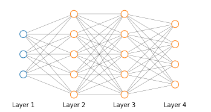

# Neural Network Cost function
Suppose we have a classification problem and we are training a neural network like that shown in the picture with $L$ number of layers and $s_l$ no of units in layer $l$; suppose we have a training set $\left \lbrace  (x^{(1)}, y^{(1)}), (x^{(2)}, y^{(2)}), \dots, (x^{(m)}, y^{(m)}) \right \rbrace$.

    

    

We are going to consider two kind of classification problems

* Binary classification: 

$$y = h_\Theta(x) \in \mathbb{R};\quad S_L=1;\quad K=1$$

* Multi-class classification (for K classes)

$$y \in \mathbb{R}^K;\quad S_L=K;\quad K \geq 3$$

Whereas the cost function for logistic regression $\eqref{eq:logregcost}$ is

$$
\begin{equation}
J(\theta)=-\frac{1}{m}\left[\sum^m_{i=1}y^{(i)}\log h_\theta\left(x^{(i)}\right)+\left(1-y^{(i)}\right)\log\left(1-h_\theta(x^{(1)}\right)\right] +\frac{\lambda}{2m}\sum_{j=1}^n\theta_j^2
\end{equation}
\label{eq:logregcost} \tag{1}
$$

The cost function for a neural network $\eqref{eq:neuralnetcost}$ is a generalization where instead of having one output $y$ we kay have $K$ of them and the regularization term sums over all values of $\Theta_{ji}^{(l)}$ (excluding the bias unit)

$$
\begin{align}
J(\Theta)=&-\frac{1}{m}\left[\sum^m_{i=1}\sum^K_{k=1}y_k^{(i)}\log \left(h_\Theta\left(x^{(i)}\right)\right)_k+\left(1-y_k^{(i)}\right)\log\left(1-h_\Theta \left(x^{(1)}\right)\right)_k\right] \\
&+\frac{\lambda}{2m} \sum_{l=1}^{L-1} \sum_{i=1}^{s_l} \sum_{j=1}^{s_{l+1}}\left(\Theta_{ji}^{(l)}\right)^2
\end{align}
\label{eq:neuralnetcost} \tag{2}
$$

* the double sum simply adds up the logistic regression costs calculated for each cell in the output layer
* the triple sum simply adds up the squares of all the individual Θs in the entire network.
* the $i$ in the triple sum does not refer to training example $i$
