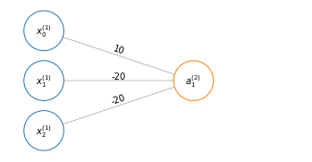
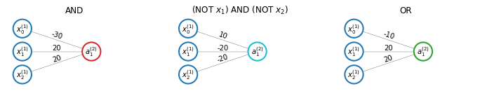
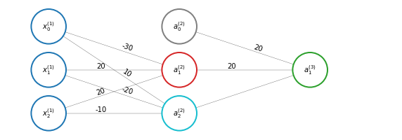

# Neural Network builds complex non-linear functions
In this section we will explain how a neural network can build relatively complex non-linear functions.

Let's take a non-linear classification example like that depicted below, where panel A is just a simplified version of panel B.

This is a non-linear classification example modeled by the logical XNOR function

$$
\begin{align}
&x_1 \; \text{XNOR} \; x_2 \\
&\text{NOT} \; (x_1 \; \text{XOR} \; x_2)
\end{align}
$$

## Logical AND function
Let's look at a neural network that can calculate the logical $\text{AND}$ function.

$$
\begin{align}
&x_1,x_2\in \lbrace 0,1 \rbrace\\
&y= x_1 \wedge x_2\\
&\Theta^{(1)} = 
\begin{bmatrix}-30\\20\\20\end{bmatrix}
\end{align}
$$

So that 

$$
\begin{equation}
h_\Theta(x) = g(-30+20x_1+20x_2)
\end{equation}
\label{eq:h} \tag{1}
$$

Since the sigmoid activation function $g(z)$ is

The the output of $\eqref{eq:h}$ is

<table id="T_f5223168_4f76_11eb_9a8d_40a3cc65d4e3" ><thead>    <tr>        <th class="col_heading level0 col0" >$x_1$</th>        <th class="col_heading level0 col1" >$x_2$</th>        <th class="col_heading level0 col2" >$h_\Theta(x)$</th>    </tr></thead><tbody>
                <tr>
                                <td id="T_f5223168_4f76_11eb_9a8d_40a3cc65d4e3row0_col0" class="data row0 col0" >0</td>
                        <td id="T_f5223168_4f76_11eb_9a8d_40a3cc65d4e3row0_col1" class="data row0 col1" >0</td>
                        <td id="T_f5223168_4f76_11eb_9a8d_40a3cc65d4e3row0_col2" class="data row0 col2" >$g(-30) \approx 0$</td>
            </tr>
            <tr>
                                <td id="T_f5223168_4f76_11eb_9a8d_40a3cc65d4e3row1_col0" class="data row1 col0" >0</td>
                        <td id="T_f5223168_4f76_11eb_9a8d_40a3cc65d4e3row1_col1" class="data row1 col1" >1</td>
                        <td id="T_f5223168_4f76_11eb_9a8d_40a3cc65d4e3row1_col2" class="data row1 col2" >$g(-10) \approx 0$</td>
            </tr>
            <tr>
                                <td id="T_f5223168_4f76_11eb_9a8d_40a3cc65d4e3row2_col0" class="data row2 col0" >1</td>
                        <td id="T_f5223168_4f76_11eb_9a8d_40a3cc65d4e3row2_col1" class="data row2 col1" >0</td>
                        <td id="T_f5223168_4f76_11eb_9a8d_40a3cc65d4e3row2_col2" class="data row2 col2" >$g(-10) \approx 0$</td>
            </tr>
            <tr>
                                <td id="T_f5223168_4f76_11eb_9a8d_40a3cc65d4e3row3_col0" class="data row3 col0" >1</td>
                        <td id="T_f5223168_4f76_11eb_9a8d_40a3cc65d4e3row3_col1" class="data row3 col1" >1</td>
                        <td id="T_f5223168_4f76_11eb_9a8d_40a3cc65d4e3row3_col2" class="data row3 col2" >$g(10) \approx 1$</td>
            </tr>
    </tbody></table>

Which is exactly the $x_1 \wedge x_2$.

## Logical OR function
The following network and table show instead $x_1 \vee x_2$

$$h_\Theta(x) = g(-10+20x_1+20x_2)$$

<table id="T_f5223169_4f76_11eb_9a8d_40a3cc65d4e3" ><thead>    <tr>        <th class="col_heading level0 col0" >$x_1$</th>        <th class="col_heading level0 col1" >$x_2$</th>        <th class="col_heading level0 col2" >$h_\Theta(x)$</th>    </tr></thead><tbody>
                <tr>
                                <td id="T_f5223169_4f76_11eb_9a8d_40a3cc65d4e3row0_col0" class="data row0 col0" >0</td>
                        <td id="T_f5223169_4f76_11eb_9a8d_40a3cc65d4e3row0_col1" class="data row0 col1" >0</td>
                        <td id="T_f5223169_4f76_11eb_9a8d_40a3cc65d4e3row0_col2" class="data row0 col2" >$g(-10) \approx 0$</td>
            </tr>
            <tr>
                                <td id="T_f5223169_4f76_11eb_9a8d_40a3cc65d4e3row1_col0" class="data row1 col0" >0</td>
                        <td id="T_f5223169_4f76_11eb_9a8d_40a3cc65d4e3row1_col1" class="data row1 col1" >1</td>
                        <td id="T_f5223169_4f76_11eb_9a8d_40a3cc65d4e3row1_col2" class="data row1 col2" >$g(10) \approx 1$</td>
            </tr>
            <tr>
                                <td id="T_f5223169_4f76_11eb_9a8d_40a3cc65d4e3row2_col0" class="data row2 col0" >1</td>
                        <td id="T_f5223169_4f76_11eb_9a8d_40a3cc65d4e3row2_col1" class="data row2 col1" >0</td>
                        <td id="T_f5223169_4f76_11eb_9a8d_40a3cc65d4e3row2_col2" class="data row2 col2" >$g(10) \approx 1$</td>
            </tr>
            <tr>
                                <td id="T_f5223169_4f76_11eb_9a8d_40a3cc65d4e3row3_col0" class="data row3 col0" >1</td>
                        <td id="T_f5223169_4f76_11eb_9a8d_40a3cc65d4e3row3_col1" class="data row3 col1" >1</td>
                        <td id="T_f5223169_4f76_11eb_9a8d_40a3cc65d4e3row3_col2" class="data row3 col2" >$g(30) \approx 1$</td>
            </tr>
    </tbody></table>

## Logical NOT function

<table id="T_f522316a_4f76_11eb_9a8d_40a3cc65d4e3" ><thead>    <tr>        <th class="col_heading level0 col0" >$x_1$</th>        <th class="col_heading level0 col1" >$h_\Theta(x)$</th>    </tr></thead><tbody>
                <tr>
                                <td id="T_f522316a_4f76_11eb_9a8d_40a3cc65d4e3row0_col0" class="data row0 col0" >0</td>
                        <td id="T_f522316a_4f76_11eb_9a8d_40a3cc65d4e3row0_col1" class="data row0 col1" >$g(10) \approx 1$</td>
            </tr>
            <tr>
                                <td id="T_f522316a_4f76_11eb_9a8d_40a3cc65d4e3row1_col0" class="data row1 col0" >1</td>
                        <td id="T_f522316a_4f76_11eb_9a8d_40a3cc65d4e3row1_col1" class="data row1 col1" >$g(-10) \approx 0$</td>
            </tr>
    </tbody></table>

## Logical NOT-1 AND NOT-2 function

<table id="T_f522316b_4f76_11eb_9a8d_40a3cc65d4e3" ><thead>    <tr>        <th class="col_heading level0 col0" >$x_1$</th>        <th class="col_heading level0 col1" >$x_2$</th>        <th class="col_heading level0 col2" >$h_\Theta(x)$</th>    </tr></thead><tbody>
                <tr>
                                <td id="T_f522316b_4f76_11eb_9a8d_40a3cc65d4e3row0_col0" class="data row0 col0" >0</td>
                        <td id="T_f522316b_4f76_11eb_9a8d_40a3cc65d4e3row0_col1" class="data row0 col1" >0</td>
                        <td id="T_f522316b_4f76_11eb_9a8d_40a3cc65d4e3row0_col2" class="data row0 col2" >$g(10) \approx 1$</td>
            </tr>
            <tr>
                                <td id="T_f522316b_4f76_11eb_9a8d_40a3cc65d4e3row1_col0" class="data row1 col0" >0</td>
                        <td id="T_f522316b_4f76_11eb_9a8d_40a3cc65d4e3row1_col1" class="data row1 col1" >1</td>
                        <td id="T_f522316b_4f76_11eb_9a8d_40a3cc65d4e3row1_col2" class="data row1 col2" >$g(-10) \approx 0$</td>
            </tr>
            <tr>
                                <td id="T_f522316b_4f76_11eb_9a8d_40a3cc65d4e3row2_col0" class="data row2 col0" >1</td>
                        <td id="T_f522316b_4f76_11eb_9a8d_40a3cc65d4e3row2_col1" class="data row2 col1" >0</td>
                        <td id="T_f522316b_4f76_11eb_9a8d_40a3cc65d4e3row2_col2" class="data row2 col2" >$g(-10) \approx 0$</td>
            </tr>
            <tr>
                                <td id="T_f522316b_4f76_11eb_9a8d_40a3cc65d4e3row3_col0" class="data row3 col0" >1</td>
                        <td id="T_f522316b_4f76_11eb_9a8d_40a3cc65d4e3row3_col1" class="data row3 col1" >1</td>
                        <td id="T_f522316b_4f76_11eb_9a8d_40a3cc65d4e3row3_col2" class="data row3 col2" >$g(-30) \approx 0$</td>
            </tr>
    </tbody></table>

## Logical XNOR function

<table id="T_44de8c2a_4f7b_11eb_9a8d_40a3cc65d4e3" ><thead>    <tr>        <th class="col_heading level0 col0" >$x_1$</th>        <th class="col_heading level0 col1" >$x_2$</th>        <th class="col_heading level0 col2" >$a_1^{(2)}$</th>        <th class="col_heading level0 col3" >$a_2^{(2)}$</th>        <th class="col_heading level0 col4" >$h_\Theta(x)$</th>    </tr></thead><tbody>
                <tr>
                                <td id="T_44de8c2a_4f7b_11eb_9a8d_40a3cc65d4e3row0_col0" class="data row0 col0" >0</td>
                        <td id="T_44de8c2a_4f7b_11eb_9a8d_40a3cc65d4e3row0_col1" class="data row0 col1" >0</td>
                        <td id="T_44de8c2a_4f7b_11eb_9a8d_40a3cc65d4e3row0_col2" class="data row0 col2" >0</td>
                        <td id="T_44de8c2a_4f7b_11eb_9a8d_40a3cc65d4e3row0_col3" class="data row0 col3" >1</td>
                        <td id="T_44de8c2a_4f7b_11eb_9a8d_40a3cc65d4e3row0_col4" class="data row0 col4" >1</td>
            </tr>
            <tr>
                                <td id="T_44de8c2a_4f7b_11eb_9a8d_40a3cc65d4e3row1_col0" class="data row1 col0" >0</td>
                        <td id="T_44de8c2a_4f7b_11eb_9a8d_40a3cc65d4e3row1_col1" class="data row1 col1" >1</td>
                        <td id="T_44de8c2a_4f7b_11eb_9a8d_40a3cc65d4e3row1_col2" class="data row1 col2" >0</td>
                        <td id="T_44de8c2a_4f7b_11eb_9a8d_40a3cc65d4e3row1_col3" class="data row1 col3" >0</td>
                        <td id="T_44de8c2a_4f7b_11eb_9a8d_40a3cc65d4e3row1_col4" class="data row1 col4" >0</td>
            </tr>
            <tr>
                                <td id="T_44de8c2a_4f7b_11eb_9a8d_40a3cc65d4e3row2_col0" class="data row2 col0" >1</td>
                        <td id="T_44de8c2a_4f7b_11eb_9a8d_40a3cc65d4e3row2_col1" class="data row2 col1" >0</td>
                        <td id="T_44de8c2a_4f7b_11eb_9a8d_40a3cc65d4e3row2_col2" class="data row2 col2" >0</td>
                        <td id="T_44de8c2a_4f7b_11eb_9a8d_40a3cc65d4e3row2_col3" class="data row2 col3" >0</td>
                        <td id="T_44de8c2a_4f7b_11eb_9a8d_40a3cc65d4e3row2_col4" class="data row2 col4" >0</td>
            </tr>
            <tr>
                                <td id="T_44de8c2a_4f7b_11eb_9a8d_40a3cc65d4e3row3_col0" class="data row3 col0" >1</td>
                        <td id="T_44de8c2a_4f7b_11eb_9a8d_40a3cc65d4e3row3_col1" class="data row3 col1" >1</td>
                        <td id="T_44de8c2a_4f7b_11eb_9a8d_40a3cc65d4e3row3_col2" class="data row3 col2" >1</td>
                        <td id="T_44de8c2a_4f7b_11eb_9a8d_40a3cc65d4e3row3_col3" class="data row3 col3" >0</td>
                        <td id="T_44de8c2a_4f7b_11eb_9a8d_40a3cc65d4e3row3_col4" class="data row3 col4" >1</td>
            </tr>
    </tbody></table>

