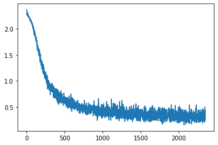

```python
%reset -f
%pylab --no-import-all inline
from types import SimpleNamespace

import torch
import torch.nn as nn
import torchvision.datasets as dsets
import torchvision.transforms as transforms
```

    Populating the interactive namespace from numpy and matplotlib


Once again we are using [MNIST dataset](https://en.wikipedia.org/wiki/MNIST_database) as in <a href="{{site.basurl}}/ML/ML7.5ML-7.5">ML7.5</a>. 

This time around, instead of getting them as PIL images to then manually convert them to tensors, we are exploiting the `transform` argument of the datasets objects [[Datasets](https://pytorch.org/vision/stable/datasets.html)]. 

We are passing the `transforms.toTensor()` method that converts a PIL Image or `numpy.ndarray` (H x W x C) in the range [0, 255] to a `torch.FloatTensor` of shape (C x H x W) in the range [0.0, 1.0] [[Transforms](https://pytorch.org/vision/stable/transforms.html)].


```python
train_dataset = dsets.MNIST(
    root="./data", train=True, transform=transforms.ToTensor(), download=True
)

test_dataset = dsets.MNIST(root="./data", train=False, transform=transforms.ToTensor())
```


```python
train_dataset
```


    Dataset MNIST
        Number of datapoints: 60000
        Root location: ./data
        Split: Train
        StandardTransform
    Transform: ToTensor()


```python
len(train_dataset)
```


    60000


The MNIST training set consists of 60000 images but we don't want to train the algorithm as a single batch. Instead, as discussed in <a href="{{site.basurl}}/ML/ML29ML-29">ML29</a> we are going to train the algorithm on mini-batches of the original training set. 

Given that we want to set batch size $m_b=128$ images and the number of epochs $=5$ we will have $60000/m_b \approx 468$ images per batch. This means that in 5 epochs the algorithm will have $2343$ training iterations


```python
batch_size = 128
epochs = 5
iterations = epochs * len(train_dataset) // batch_size
iterations
```


    2343


Let's make the dataset iteratble with the `DataLoader`


```python
train_loader = torch.utils.data.DataLoader(
    dataset=train_dataset, batch_size=batch_size, shuffle=True
)

test_loader = torch.utils.data.DataLoader(
    dataset=test_dataset, batch_size=batch_size, shuffle=False
)
```

Our model architecture will be:


```python
class FeedforwardNeuralNetModel(nn.Module):
    def __init__(self, input_dim, hidden_dim, output_dim):
        super(FeedforwardNeuralNetModel, self).__init__()
        # Linear function
        self.fc1 = nn.Linear(input_dim, hidden_dim)

        # Non-linearity
        self.sigmoid = nn.Sigmoid()

        # Linear function (readout)
        self.fc2 = nn.Linear(hidden_dim, output_dim)

    def forward(self, x):
        # Linear function  # LINEAR
        out = self.fc1(x)

        # Non-linearity  # NON-LINEAR
        out = self.sigmoid(out)

        # Linear function (readout)  # LINEAR
        out = self.fc2(out)
        return out
```

MNIST dataset is composed of images of $28 \times 28$ pixel. Each one of these images are encoded in a vector $x^{(i)} \in \mathbb{R}^{28\cdot28}$ , which will be mapped on a hidden layer and then on the output layer. The output layer must encode for 10 output classes and it is therefore a vector  $ \hat{y}^{(i)} \in \mathbb{R}^{10}$. The hidden layer can have any dimension we want, in this case we decide to have 100 hidden units, so that the input vector will be mapped to a vector $x^{(i)[1]} \in \mathbb{R}^{100}$


```python
input_dim = 28 * 28
hidden_dim = 100
output_dim = 10

model = FeedforwardNeuralNetModel(input_dim, hidden_dim, output_dim)
```

The Loss function $\mathcal{L}$ of our choice is [Cross entropy loss](https://en.wikipedia.org/wiki/Cross_entropy)


```python
criterion = nn.CrossEntropyLoss()
```


```python
learning_rate = 0.1

optimizer = torch.optim.SGD(model.parameters(), lr=learning_rate)
```


```python
iter = 0
losses = []
for epoch in range(epochs):
    for i, (images, labels) in enumerate(train_loader):
        # Load images with gradient accumulation capabilities
        images = images.view(-1, 28 * 28).requires_grad_()

        # Clear gradients w.r.t. parameters
        optimizer.zero_grad()

        # Forward pass to get output/logits
        outputs = model(images)

        # Calculate Loss: softmax --> cross entropy loss
        loss = criterion(outputs, labels)

        # Getting gradients w.r.t. parameters
        loss.backward()

        # Updating parameters
        optimizer.step()

        iter += 1
        losses.append(loss.item())
        if iter % 500 == 0:
            # Calculate Accuracy
            correct = 0
            total = 0
            # Iterate through test dataset
            for images, labels in test_loader:
                # Load images with gradient accumulation capabilities
                images = images.view(-1, 28 * 28).requires_grad_()

                # Forward pass only to get logits/output
                outputs = model(images)

                # Get predictions from the maximum value
                _, predicted = torch.max(outputs.data, 1)

                # Total number of labels
                total += labels.size(0)

                # Total correct predictions
                correct += (predicted == labels).sum()

            accuracy = 100 * correct / total

            # Print Loss
            print(
                "Iteration: {}. Loss: {}. Accuracy: {}".format(
                    iter, loss.item(), accuracy
                )
            )
```

    Iteration: 500. Loss: 0.6435608267784119. Accuracy: 86.37999725341797
    Iteration: 1000. Loss: 0.5419746041297913. Accuracy: 89.30999755859375
    Iteration: 1500. Loss: 0.36404168605804443. Accuracy: 90.58000183105469
    Iteration: 2000. Loss: 0.39016854763031006. Accuracy: 91.26000213623047


```python
plt.plot(losses);
```


    

    


```python

```
