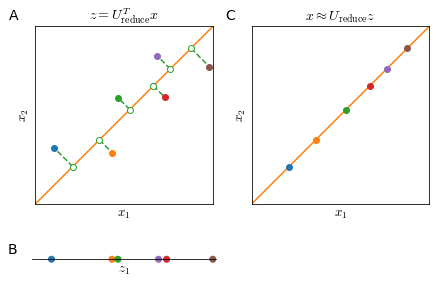

# Dimensionality Reduction
When training a learning algorithm on a training set with hundreds or thousands of features, it is very likely that some of them are redundant as in <a href="#redundantlen">Figure 22</a>. Two features do not need to be encoding for the same property to be redundant, it is sufficient that they are highly correlated.


    

<figure id="redundantlen">
    
    <figcaption>Figure 22. Two redundant features (same property in different units of measure, the relationship not being perfectly linear is due to different approximation of the measurements) (A); Two redundant features measuring different but highly correlated properties (B); features space of panel A collapsed in (projected on) a single dimension (C) </figcaption>
</figure>

Dimensionality reduction is not limited to bi-dimensional data; a typical task of dimensionality reduction could be to reduce a $\mathbb{R}^{1000}$ to a $\mathbb{R}^{100}$ feature space

Dimensionality reduction is used for two main purposes: **data compression** and **data visualization**. Data compression is a label that covers a very wide range of uses, from simply occupying less virtual memory for files in hard disk to speed up learning algorithms; the use of dimensionality reduction for data visualization aims at reducing $n$ features to 2 or 3 features, which are the maximum number of dimensions in a plot.

##  Principal Component Analysis
Principal Component Analysis (PCA) is the most common algorithm for dimensionality reduction.

If we want to reduce data from 2 dimensions to 1 dimension (<a href="#pcaline">Figure 23</a>), the goal of PCA is to find a vector $u^{(1)} \in \mathbb{R^n}$ onto which to project the data so as to minimize the projection error.


    

<figure id="pcaline">
    
    <figcaption>Figure 23. Distance calculation for PCA in the linear case (A) and linear regression (B).</figcaption>
</figure>

In $n$ dimensions PCA tries to find a surface with a smaller number of dimensions $k$ ($k$ vectors $u^{(1)}, u^{(2)}, \ldots, u^{(k)}$) on which to project the data so that the sum of squares of the projections distance (projection error) is minimized.

### PCA vs Linear Regression
While it may be cosmetically similar, there is substantial difference between PCA and linear regression. 

In linear regression (<a href="#pcaline">Figure 23</a>, panel B) we try to predict some value $y$ given some input feature $x_1$  and in training linear regression we try to minimize the **vertical distance** between $x_1, y$ points and a straight line.

In PCA (<a href="#pcaline">Figure 23</a>, panel A) there is no variable $y$: we try to reduce the dimensionality of a feature space $x_1, x_2$ by minimizing the **projection error** of feature points and a straight line.

## PCA algorithm
### Preprocessing
For PCA to work properly is essential to pre-process data. 

With **mean normalization** we replace each $x_j^{(i)}$ with $x_j - \mu_j$, where 

$$\mu_j = \frac{1}{m}\sum^m_{i=1}x_j^{(i)}$$

If different features are on different scales we need to **scale features** to a comparable range of values 

$$\frac{x_j - \mu_j}{s_j}$$

where $s_j$ is a measure of the range of values of $x_j$, commonly the standard deviation.

### Dimensionality reduction
The objective of PCA is to project a higher number of dimensions $n$ on a lower number of dimensions $k$ (defined by $k$ vectors $ \{u_1, u_2, \ldots, u_k \}$), as shown in <a href="#redundantlen">Figure 22</a>, panels A and C.

The mathematical proof of this process is rather complex but the procedure is instead quite simple.

The first step in the PCA algorithm is the calculation of the [covariance matrix](https://en.wikipedia.org/wiki/Covariance_matrix) $\Sigma$, which will be an $n \times n$ matrix

$$
\Sigma = \frac{1}{m} \sum^n_{i=1} \left ( x^{(i)} \right )\left ( x^{(i)} \right )^T
$$

and then calculate the [eigenvectors](https://en.wikipedia.org/wiki/Eigenvalues_and_eigenvectors) of $\Sigma$. Since $\Sigma$ is a [symmetric positive definite matrix](https://en.wikipedia.org/wiki/Definite_symmetric_matrix) you usually calculate the eigenvectors with [Singular Value Decomposition](https://en.wikipedia.org/wiki/Singular_value_decomposition) (SVD). 

SVD outputs three matrices $U, S, V$. To identify the new vector space are only interested in the $U$ matrix. This will also be an $n \times n$ matrix, whose columns represents the vectors $u$.

$$
U=
\begin{bmatrix}
| & | &  & | \\
u^{(1)} & u^{(2)} & \cdots & u^{(n)} \\
| & | &  & | \\
\end{bmatrix} \in \mathbb{R}^{n \times n}
$$

To obtain the reduced space described by $k$ vectors $u$ we just take the first $k$ columns from the matrix $U$.

$$
U_\text{reduce}=
\begin{bmatrix}
| & | &  & | \\
u^{(1)} & u^{(2)} & \cdots & u^{(k)} \\
| & | &  & | \\
\end{bmatrix} \in \mathbb{R}^{n \times k}
$$

And the projection of features $x \in \mathbb{R}^n$ to components $z \in \mathbb{R}^k$ is calculated as 

$$
z = U_\text{reduce}^T x 
$$

and since $U_\text{reduce}^T \in \mathbb{R}^{k \times n}$ and $x \in \mathbb{R}^{n \times 1}$, then $z \in \mathbb{R}^{k \times 1}$ or $z \in \mathbb{R}^k$

## Reconstruction from compressed data
Reconstruction from projected data $z$ to original data $x$ is possible but with some loss of information. 

In order to get an approximation of the original feature vector $x$ we can 

$$
x \approx U_\text{reduce}^T z
$$

However, all points of $x$ will be along the $u$ vector and we will lose exactly the information of the projection error.

So, the smaller the projection error, the more faithful the reconstruction.


    

    


## Setting the number of Principal Components
The rule of thumb adopted usually to decide the hyper-parameter $k$ (the number of principal components) is this:

Given the average squared projection error

$$
\frac{1}{m} \sum^m_{i=1} \left \| x^{(i)} - x^{(i)}_\text{approx} \right \|^2
$$

and the total variation in the data

$$
\frac{1}{m} \sum^m_{i=1} \left \| x^{(i)} \right \|^2
$$

Typically, $k$ is chosen to be the smallest value so that

$$
\begin{equation}
\frac{\frac{1}{m} \sum^m_{i=1} \left \| x^{(i)} - x^{(i)}_\text{approx} \right \|^2}
{\frac{1}{m} \sum^m_{i=1} \left \| x^{(i)} \right \|^2} \leq 0.01
\end{equation}
\label{eq:pcakcondition} \tag{1}
$$

In other words, $k$ is chosen so that $99\%$ of the variance is retained. Depending on the necessities, $k$ can also be chosen as to retain $95\%$ or $90\%$ of the variance; these two are also quite typical values, but usually $99\%$ is chosen.

In order to calculate $k$, we can proceed by just calculating PCA for each $k \in [1, n]$  until we find $\eqref{eq:pcakcondition}$ satisfied.

Alternatively, we can use the matrix $S$ returned by the $\mathrm{SVD}(\Sigma)$ to calculate the variance efficiently. Where $S$ is

$$
S=\begin{bmatrix}
S_{1,1} & 0 & 0 & 0\\
0 & S_{2,2} & 0 & 0\\
0 & 0 & \ddots & 0\\
0 & 0 & 0 & S_{n, n} \\
\end{bmatrix} \in \mathbb{R}^{n \times n}
$$

then the condition $\mathrm{SVD}(\Sigma)$ for a given $k$ becomes

$$
\begin{equation}
1-\frac{\sum^k_{i=1}S_{i,i}}{\sum^n_{i=1}S_{i,i}} \leq 0.1
\end{equation}
\label{eq:pcakconditionsvd} \tag{2}
$$

Or in other words that the sum of the first $k$ diagonal values divided by all diagonal values is $\geq 0.99$. This means that $\mathrm{SVD}(\Sigma)$ needs to be called only once since once you have $S$ you can check for condition $\eqref{eq:pcakconditionsvd}$ for all values of $k$.


```python

```
