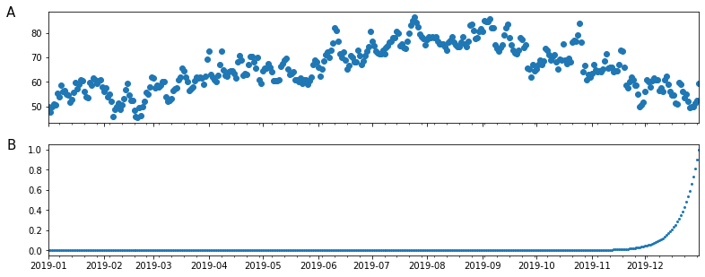

# More sophisticated optimization techniques
There are other more sophisticated optimization techniques than gradient descent, in order to talk about them let's introduce **exponentially weighted averages**

## Exponentially weighted averages
Let's take the average daily temperature in London across the year 2019 (<a href="#londtemp">figure below</a>)

    

<figure id="londtemp">
    
    <figcaption>Figure 56. Average daily temperatures in the year 2019 in London</figcaption>
</figure>

The data looks noisy and in order to compute the trend of the temperature across the year we can use the following approach. Starting from the first day $v_0=0$ we can proceed by averaging:

$$
\begin{aligned}
&v_0=0\\
&v_1 = 0.9v_0 + 0.1 \theta_1 \\
&v_2 = 0.9v_1 + 0.1 \theta_2 \\
&v_3 = 0.9v_3 + 0.1 \theta_3 \\
& \vdots \\
&v_t = 0.9v_{t-1} + 0.1 \theta_t \\
\end{aligned}
$$

where $\theta_i$ is current temperature.

Let's rewrite the generalization as:

$$
\begin{equation}
v_t = \beta v_{t-1} + (1-\beta) \theta_t
\end{equation}
\label{eq:ewa} \tag{1}
$$

We can think of $v_t$ as approximately averaging over $\frac{1}{1-\beta}$ days, so when using:

* $\beta = 0.9 \to \frac{1}{1-0.9} \approx$ average 10 over days
* $\beta = 0.98 \to \frac{1}{1-0.98} \approx$ average over 50 days
* $\beta = 0.5 \to \frac{1}{1-5} \approx$ average over 2 days

    

<figure id="ewa">
    
    <figcaption>Figure 57. Exponentially weighted average applied to raw data with different values of $\beta$</figcaption>
</figure>

As we can see in <a href="#ewa">the figure above</a>, increasing values of $\beta$ will produce smoother trends but on the flipside, we can notice that the smoothest trend is also shifted towards the right, since the rolling windows (the number of days on which each point is averaged on) is bigger and adapts more slowly to how the temperature changes. In fact, by setting a large $\beta$, we are giving a greater weight to the temperatures that have come before ($v_t$) and a smaller weight to the current temperature.

The equation in $\eqref{eq:ewa}$ is how you implement an **exponentially weighted moving average** or exponentially weighted average for short. The reason why they are called exponentially weighted averages become clear if we look at how $v_n$ is computed, let's take $v_{100}$:

$$
\begin{split}
& v_{100} = 0.1 \theta_{100} + 0.9 & v_{99} & \\
&& \shortparallel \\ &
&  0.1 \theta_{99} + 0.9 & v_{98} &\\
&&& \shortparallel \\
&&&  0.1 \theta_{98} + 0.9 & v_{97} \\
\end{split}
$$

And by expanding the algebra we can see that

$$
v_{100} = 0.1 \cdot 0.9 \theta_{99} + 0.1 \cdot (0.9)^2 \theta_{98} + 0.1 \cdot (0.9)^3 \theta_{97} + 0.1 \cdot (0.9)^4 \theta_{96} \dots
$$

So this is a weighted sum of $\theta$s where the weight of $\theta$ increases exponentially with the steps back from the current $\theta$. We can visualize that in the figure below

    

    

In order to say that $\beta = 0.9$ corresponds to averaging over around 10 days we observe that $0.9^{10} \approx 0.35 \approx \frac{1}{e}$, and more in general we have $(1 - \epsilon)^{\frac{1}{\epsilon}} = \frac{1}{e}$ (where $\epsilon = 1-\beta$).

All the terms $(1-\beta) \cdot \beta^x \approx 1$ up to a detail called bias correction. Especially around the first values of $v$, the approximation will be greatly underestimating the data since it cannot base on the full size of the window.

In order to reduce that error we use a corrected version of $v_t$

$$
\frac{v_t}{1-\beta^t}
$$

## Gradient descent with momentum
