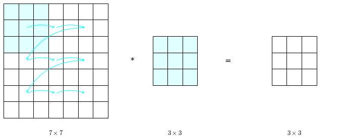

# Computer Vision
Computer vision is one of the areas that has advanced rapidly thanks to deep learning. Many of the strategies developed specifically for image recognition have been then transferred to other tasks such as speech recognition.

Some of the main problems in computer vision are:

* image classification: tell if a picture belong to a certain class or not
* object detection: identify the presence and position of one or multiple classes of objects in a picture
* neural style transfer: apply the style of one picture to another picture

One of the main issues in computer vision ML problems is that the input $x$ can become very big. Consider a low-resolution image of $64\times 64 \mathrm{px}$, since there are three color channels we would have an input vector for image $i$, $x^{(i)} \in \mathbb{R}^{64 \cdot 64 \cdot 3 = 12288 \times 1}$ 

Consider now an high resolution picture of $1000 \times 1000 \mathrm{px}$, we would have $x^{(i)} \in \mathbb{R}^{3 \cdot 10^6 \times 1}$. Supposing that the first hidden layer of a NN has 1000 hidden units we would have $w^{(i)[1]} \in \mathbb{R}^{1000 \times 3 \cdot 10^6}$. With that many parameters is difficult to get enough data to prevent the model from overfitting and also the computational requirements are very high.

But since we want to analyze large images, we employ **convolution operations** one of the fundamental building blocks of **Convolutional neural networks**.

## Edge detection
The convolution operation is one of the fundamental building blocks of convolutional neural networks. Let's see how the convolution operation works using edge detection, one of the main tasks in computer vision, as motivating example. The convolution operation takes as input an image and a filter and produces a new image, which is the result of the convolution of the filter over the image. Some filters, can detect edges (<a href="fig:edgedet">figure below</a>), other can blur or sharpen an image.  


    

<figure id="fig:edgedet">
    
    <figcaption>Figure 75. The image of a rectangle (A) and the result of applying a vertical edge-detection filter (B) and an horizontal edge-detection filter (B)</figcaption>
</figure>

The convolution operation is based on rolling a filter (sometimes called kernel) on an image. Each step taken by the filter over the image produces a single number, which results from the sum of the element-wise product between the filter values and the portion of image values covered by the filter. In the case shown in <a href="#fig:convolution">Figure 76</a> the filter used is a vertical edge detection filter, which is able to highlight vertical contrasting regions in a broader image.


    

<figure id="fig:convolution">
    
    <figcaption>Figure 76. One step of convolution of a $3\times 3$ vertical edge detection filter over a $6 \times 6$ image, resulting in a $4 \times 4$ convolved feature.</figcaption>
</figure>

Why is the kernel in <a href="#fig:convolution">Figure 76</a>, panel A). In this image there is a strong vertical edge in the middle as it transitions from bright to dark. By applying the vertical edge detection filter we obtain an image with a bright vertical line in the middle, brighter, in fact, than the bright color in the input image. And so, the convolution it successfully detected the position and highlighted the vertical edge in the input image.

Convolving the same kernel with a mirrored input image (<a href="#fig:vertedgedet">Figure 77</a>, panel B) results in an image where the values of the detected portion are negative. The fact that the detected edge is dark indicates that in the input image there is a **dark-to-light transition**, while in the previous image the bright detection indicates that in the input image there was a **light-to-dark-transition**.


    

<figure id="fig:vertedgedet">
    
    <figcaption>Figure 77. Vertical edge detection applied to an image with its left half bright and its right half dark (A), and to its mirrored version (B)</figcaption>
</figure>

We can easily imagine that an **horizontal filter** is just a transposed version of the vertical filter that we have seen until now. In reality, many different filters exist that perform a number of operations.

## Learning to detect edges
The vertical filter we have seen is just one of many vertical filters. There has been a fair amount of discussion in the computer vision community on which is the best filter for vertical edge detection. Many filters have been handcrafted to satisfy a variety of needs (not only vertical edge detection) like for example the Sobel filter (<a href="#fig:filters">Figure 78</a>, panel C).


    

<figure id="fig:filters">
    
    <figcaption>Figure 78. Two hand designed filters, the Sobel (A) and Scharr (B) filters, and a filter made of the learned parameters (C)</figcaption>
</figure>

## Padding
In order to build convolutional neural network we need to modify the process of convolution that we have seen up to this point and add **padding**. The convolution process as we know it takes as input an $n \times n$ image and convolve it with a $f \times f$ filter to produce a $(n-f+1) \times (n-f+1)$ output. For example, a $6 \times 6$ image with a $3 \times 3$ filter produces a $4 \times 4$ output. This is because the filter can only explore $4 \times 4$ position in the input image without one of its cell going outside of the image.

The two downside to this are:

* each time you apply convolution your image shrinks
* pixels along the edges and especially pixels in the corners are used much fewer times (contribute less to the output) than pixels in the middle.

With padding, a border of one unit is added to the image so that the side becomes $n+2p$, where $p$ is the amount of padding applied. This allows the filter to move freely on the edge cells, preserving the original dimensions of the input image on the convolution result (<a href="#fig:padding">Figure 79</a>).


    

<figure id="fig:padding">
    
    <figcaption>Figure 79. A $6 \times 6$ image padded to $8 \times 8$, convoluted with a $3 \times 3$ filter to produce a $6 \times 6$ output image that preserves the original dimension of the input image.</figcaption>
</figure>

There are two common choices of the amount of padding applied during convolutions, they are called **valid convolutions** and **same convolutions**.

* Valid: no padding $p=0$
* Same: set the padding size $p$ so that the output size is the same as the input size. In order for this requirement to be satisfied:

$$n+2p - f + 1 = n \qquad \Rightarrow \qquad p = \frac{f-1}{2}$$

This works because the filter, by convention, has always odd dimensions. The reason behind this decision is to have symmetric filtering and to have a central cell of the filter.

## Stride
Strided convolution is another fundamental building block for implementing convolutional neural networks


```python
import matplotlib.patches as p

canvas = np.array(list(' '*49)).reshape(7, 7)
fig, axes = plt.subplots(1, 3, figsize=(12, 4))
ax1, ax2, ax3 = axes.ravel()
fig.patch.set_visible(False)
tabs = []
tabs.append(ax1.table(canvas, loc='center', colWidths=[0.05]*7, cellLoc='center'))
tabs.append(ax2.table(np.array(list(' '*9)).reshape(3, 3), loc='center', colWidths=[0.05]*6, cellLoc='center'))
tabs.append(ax3.table(np.array(list(' '*36)).reshape(6, 6), loc='center', colWidths=[0.05]*6, cellLoc='center'))
t = ax2.text(0.05, 0.5, '*', va='center', ha='left', transform=ax2.transAxes, fontsize=15)
t = ax3.text(-.2, 0.5, '=', va='center', ha='left', transform=ax3.transAxes, fontsize=15)
ax1.text(0.5, -.2, '$8\\times 8 $\n $(n+2p) \\times (n+2p)$', va='top', ha='center', transform=ax1.transAxes, fontsize=13)
ax2.text(0.5, -.2, '$3\\times 3$\n $f \\times f$', va='top', ha='center', transform=ax2.transAxes, fontsize=13)
ax3.text(0.5, -.2, '$6\\times 6 $\n $(n+2p-f+1) \\times (n+2p-f+1)$', va='top', ha='center', transform=ax3.transAxes, fontsize=13)

for ax, tab in zip(axes.ravel(), tabs):
    tab.auto_set_font_size(False)
    tab.set_fontsize(13)
    tab.scale(3, 3)
    ax.axis('off')
    ax.axis('tight')
    ax.set_aspect('equal')
    
ax1.annotate('', (3/14, 11/14), (7/14, 11/14), xycoords=tabs[0], textcoords=tabs[0], va='center', ha='center', arrowprops=dict(connectionstyle='arc3,rad=.2', arrowstyle="<-", edgecolor='cyan'))
ax1.annotate('', (7/14, 11/14), (11/14, 11/14), xycoords=tabs[0], textcoords=tabs[0], va='center', ha='center', arrowprops=dict(connectionstyle='arc3,rad=.2', arrowstyle="<-", edgecolor='cyan'))
ax1.annotate('', (3/14, 7/14), (7/14, 7/14), xycoords=tabs[0], textcoords=tabs[0], va='center', ha='center', arrowprops=dict(connectionstyle='arc3,rad=.2', arrowstyle="<-", edgecolor='cyan'))
ax1.annotate('', (7/14, 7/14), (11/14, 7/14), xycoords=tabs[0], textcoords=tabs[0], va='center', ha='center', arrowprops=dict(connectionstyle='arc3,rad=.2', arrowstyle="<-", edgecolor='cyan'))
ax1.annotate('', (3/14, 3/14), (7/14, 3/14), xycoords=tabs[0], textcoords=tabs[0], va='center', ha='center', arrowprops=dict(connectionstyle='arc3,rad=.2', arrowstyle="<-", edgecolor='cyan'))
ax1.annotate('', (7/14, 3/14), (11/14, 3/14), xycoords=tabs[0], textcoords=tabs[0], va='center', ha='center', arrowprops=dict(connectionstyle='arc3,rad=.2', arrowstyle="<-", edgecolor='cyan'))
ax1.annotate('', (11/14, 11/14), (3/14, 7/14), xycoords=tabs[0], textcoords=tabs[0], va='center', ha='center', arrowprops=dict(connectionstyle='arc3,rad=0', arrowstyle="<-", edgecolor='cyan'))
ax1.annotate('', (11/14, 7/14), (3/14, 3/14), xycoords=tabs[0], textcoords=tabs[0], va='center', ha='center', arrowprops=dict(connectionstyle='arc3,rad=0', arrowstyle="<-", edgecolor='cyan'))

canvas = tabs[0].get_celld()
for i in range(3):
    for j in range(3):
        canvas[i, j].set_facecolor('lightcyan')
```


    

    


```python

```
