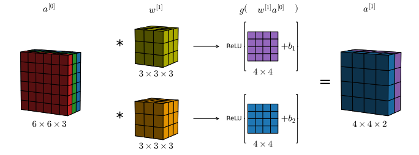

# Convolutional neural network
From what we have seen in <a hre="ML33#fig:multifilter">the multiple filters figure</a>, e can proceed to produce one layer of out convolutional neural network. Building on the application of multiple filters to a single image, we can imagine to add the bias terms $b_i \in \mathbb{R}$  and apply a non-linear activation funtion, to the single, 1-channel output matrices.


    

    


```python

```
