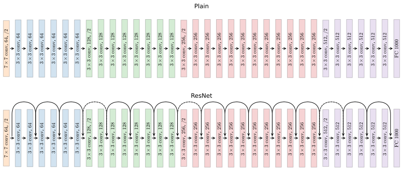

# Case Studies
The past few year of research on convolutional networks applied to computer vision has focused on the design of architectures of convolutional networks. Looking at some examples of CNN designs is useful for two main reasons: first, a number of problems have already been faced by someone else, and looking at how they resolved the problem is sometimes very insightful. Second, to gain intuitions on how to design your own network it is important to look at how others have done it before. Furthermore, a lot of these idea that were specifically designed for computer vision, are cross-contaminating with other fields. We will see:

* Some classic networks, some of these works laid the foundations of modern computer vision ML:
    * LeNet-5
    * AelxNet
    * VGG

* ResNet, or **residual network**, an example of building a very deep (152) layers neural network effectively. 
* A case study of **inception** neural network

## Classic networks
### LeNet-5
The goal of the network was to recognize handwritten digits, its architecture is shown in <a href="#fig:lenet5">Figure 90</a>. LeNet-5 architecture starts with a $32 \times 32 \times 1$ grayscale image. In the first step a set of 6 $5 \times 5$ filters with stride $s=1$ and valid padding. This reduce the image to an $28 \times 28 \times 6$ output representation in CONV1 layer. Then the LeNet-5 applies average pooling with a $2 \times 2$ filter with stride $s=2$ that reduces the image to $14 \times 14 \times 6$. Right now a max-pooling is usually used but at the time, average pooling was more popular. The CONV2 layer is obtained by applying 16 $5 \times 5$  filters with stride $s=1$ and valid padding, which result in a $10 \times 10 \times 16$ output representation. When the LeNet-5 network was published padding was not used and in fact it is not applied to the CONV1 and CONV2 layers of this network. A second average pooling layer POOL2 is obtained by a $2 \times 2$ filter with stride $s=2$, which results in a $5\times 5 \times 16$ representation. This 3D matrix is reshaped in a $400 \times 1$ vector in the FC1 layer which is fully connected two FC2 ($120 \times 1$) and FC3 ($84 \times 1$). Finally a $10 \times 1$ output layer allow the multi-class classification. In modern days networks it would be a softmax classifier while in the LeNet-5 a less used classifier was employed.


    

<figure id="fig:lenet5">
    
    <figcaption>Figure 90. Architecture of the LeNet-5 classic network</figcaption>
</figure>

The LeNet-5 network is small by today's standard with approximately 60.000 thousand parameters in total, where nowadays we see networks in the range of 10-100 million parameters. Some other differences in the LeNet-5 architecture from modern standard in CNNs and neural networks in general is the activation function, where the sigmoid and tanh were used back then while we now almost always use ReLU. Furthermore the activation function was applied after pooling, while we now usually apply it before pooling. A couple of things are still designed in the same way in modern networks: as you go deeper in the network, there is a gradual shrink in height and width and the growth in the number of channels; convolutional and pooling layers alternate, even if not always with a 1:1 ratio. 

### AlexNet
The AlexNet has a similar architecture to LeNet-5 (<a href="#fig:alexnet">Figure 91</a>), in the sense that it alternates pooling layers to convolutional layers with the latest layers being fully connected. It is also similar in the fact that the number of channels grows further down in the network. However it has also many differences. AlexNet uses ReLU activation functions and makes use of *same* padding to prevent excessive shrinking in the width and height dimension. AlexNet has 1000 output classes assigned with a final softmax classifier layer. It has 60 million total parameters and this, together with the possibility of being trained on much more data were the reasons behind its remarkable performance.


    

<figure id="fig:alexnet">
    
    <figcaption>Figure 91. The AlexNet architecture</figcaption>
</figure>

The AlexNet has a fairly complicated architecture with many hyperparameters. This contrasts with the next classic network, the VGG-16

### VGG-16
A remarkable difference in the design of the VGG-16 network is that, compared to other networks it has a relatively simple architecture (<a href="#fig:vgg16">Figure 92</a>). When designing the VGG-16 network, the decision was taken to only employ convolutional layers with $f=3,s=1$ and *same* padding, and max-pooling layers with $f=2,s=2$. This really simplify the network architecture. The VGG-16 is deeper than the LeNet-5 and the AlexNet; it has 16 layers with parameters and a $\approx 138 M$ parameters in total, which makes it a large network even for today's standards. The VGG-16 architecture alternates 2 or 3 convolutional layers to a max-pooling layer, gradually increasing the number of channels and decreasing in height and width the representation. The number of channels increases in powers of 2, from 64 to 128, to 256 and finally to 512. Another even deeper version exists, the VGG-19 with 19 layer with parameters, but since it performs in most cases as the VGG-16, the latter is preferred since it has fewer parameters and it is thus faster to train. 


    

<figure id="fig:vgg16">
    
    <figcaption>Figure 92. Architecture of the VGG-16 network, representations are only shown as their dimensions since the aspect of most of them would make the figure unreadable.</figcaption>
</figure>

## ResNets
Very deep neural networks are difficult to train because they tend to suffer from vanishing or exploding gradients (<a href="{{site.basurl}}/ML/ML28">ML28</a>). With **skip connection**, units in a layers are connected directly to units in much deeper (or shallower) layers skipping all intermediate layers. **Residual networks** (ResNets) are built with skip connections and they allow to train very deep neural networks with up to hundred of layers).

ResNets are built off of **residual blocks**. In a normal neural network for information to flow from an activation unit $a^{[l]}$ to $a^{[l+2]}$ it would need to undergo two linear and two non-linear transformations (<a href="#fig:resblock">Figure 93</a>), in a residual block $a^{[l]}$ takes a short cut and it is plainly added to $z^{[l+2]}$ before applying the second non-linearity function, so that $a^{[l+2]}=g(z^{[l+2]}+a^{[l]})$


    

<figure id="fig:resblock">
    
    <figcaption>Figure 93. Concept of skip connection in a residual block. The flow of information in a normal neural network and the shortcut took by a residual block</figcaption>
</figure>

What the inventors of residual networks proved, was that by stacking many residual blocks into a residual network, it was possible to train much deeper networks compared to "plain networks" as they refer to into their manuscript. While training a deep neural network, as you increase the number of layers the error on the training set tends to decrease until a certain point. After a certain number of layers the training error tends to go back up, where in theory the deeper the network, the better the training error. In practice, due to vanishing or exploding gradient (<a href="{{site.basurl}}/ML/ML28">ML28</a>, panel A). With a Resnet, even if number of layers get deeper the training error keeps getting lower as we expect, even with networks 100 layers deep. Recent research employed residual networks 1000 layers deep not suffering from performance deterioration despite the large number of layers. 


    

<figure id="fig:resnetperf">
    
    <figcaption>Figure 94. Error on the training set as a function of the number of layers in a plain network (A) and in a residual network (B)</figcaption>
</figure>

The reason why ResNet allow very deep networks to not loose performance stands in their ability to easily represent the identity function, rendering the network simple when the data requires it. Let's see what that means: when $a^{[l]}$ skips the connection it is injected in the computation of $a^{[l+2]}$:

$$
\begin{split}
a^{[l+2]} & = g \left( z^{[l+2]} + a^{[l]}\right) \\
&=g(W^{[l+2]} a^{[l+1]} + b^{[l+2]} + a^{[l]})
\end{split}
$$

If we are using $L_2$ regularization weight decay that would tend to shrink the value of $W^{[l+2]}$ and, less importantly, of $b^{[l+2]}$. If both those elements tend to zero, then

$$
a^{[l+2]} = g (a^{[l]})
$$

Since we are using ReLU activation function, then $g (a^{[l]}) = a^{[l]}$, which means

$$
a^{[l+2]} = a^{[l]}
$$

This means that the identity function is easy for a residual block to learn. This, in turn means that having the two layers between $a^{[l]}$ and $a^{[l+2]}$ doesn't hurt performance, because when the data requires it, it will be easy for the network to just ignore those two layers. On the contrary, if the data is complex and requires a more complex representation, those layers can learn different and relevant parameters for the output representation. In fact, what goes wrong in very deep plain networks is that in deeper layers it becomes increasingly different to learn even identity functions and so the performance will decay if the network is too complex compared to the target function.

### ResNet requires dimension uniformity
One requirement of residual blocks is for $z^{[l+2]}$ and $a^{[l]}$ to have the same dimensions since they are added together. In order to achieve dimension uniformity usually *same* padding is used between convolutional layers.


    

    


```python

```
