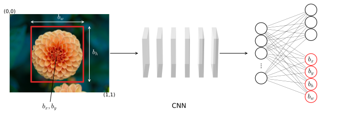

# Object detection
Object detection is one of the area that has improved more in the last few years. The first step towards object detection is **object localization**.

## Object localization
Image classification is the problem of predicting the class of an object shown in a picture. A task of image classification with localization produces a predicted label for the image and also finds the exact location of the labeled object within the image. Finding the location of an object means defining a **bounding box** that contains the recognized object. Finally an object detection task detects multiple objects (even of different classes) in an image and all their locations.

To train a network on an object localization task we can build on the image classification architectures that we have seen so far. Suppose we have a network for an image classification task that needs to distinguish 3 classes: flower, leaf, background (none of the two). We would have input images, fed into a CNN with some convolutional layers and some final fully connected layers that terminates with a softmax regression layer with 3 hidden units. In order to train a network to localize the classified object we need 4 additional output units: $b_x$, $b_y$, $b_h$, $b_w$.  


    

    


```python

```
