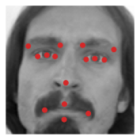

# Object detection
Object detection is one of the area that has improved more in the last few years. The first step towards object detection is **object localization**.

## Object localization
Image classification is the problem of predicting the class of an object shown in a picture. A task of image classification with localization produces a predicted label for the image and also finds the exact location of the labeled object within the image. Finding the location of an object means defining a **bounding box** that contains the recognized object. Finally an object detection task detects multiple objects (even of different classes) in an image and all their locations.

To train a network on an object localization task we can build on the image classification architectures that we have seen so far. Suppose we have a network for an image classification task that needs to distinguish 3 classes: flower, leaf, background (none of the two). We would have input images, fed into a CNN with some convolutional layers and some final fully connected layers that terminates with a softmax regression layer with 3 hidden units. In order to train a network to localize the classified object we need 4 additional output units: $b_x$, $b_y$, $b_h$, $b_w$. These 4 numbers parameterize the bounding box of the detected object.


    (427, 640, 3)


    

<figure id="fig:cnnloc">
    
    <figcaption>Figure 100. Simplified architecture of a CNN trained on a task of object localization. It takes as input an image, whose representation passes through some convolutional layers and finally to some densely connected layers. The output layers has 4 units dedicated to parameterize the bounding box for localization, with $b_x$, $b_y$ (the coordinates of the midpoint of the bounding box) and $b_w$, $b_h$ (the width and height of the bounding box)</figcaption>
</figure>

A CNN trained on a localization task needs a labeled training set with the four parameters of the bounding box defined for each example. In particular the label vector $y$ will be:

$$
y=
\begin{bmatrix}
p_c \\
b_x \\ 
b_y \\
b_h \\
b_w \\
c_1 \\
c_2
\end{bmatrix}
$$

where $p_c$ is the probability that the picture contains an object (either 1 or 0), $b_x, b_y, b_w, b_h$ are the parameters of the bounding box and $c_1$ and $c_2$ are 1 if the object in the picture is class 1 or 2 respectively, otherwise they are 0. When $p_c=0$ we can ignore all other values of the label vector $y$, since the only feature that we care to learn is that in that image there is no object. This is reflected in the loss function $\mathcal{L}(\hat{y},y)$

$$
\mathcal{L}(\hat{y},y)=
\begin{cases} 
\sum_{i=1}^{c+4}(\hat{y}_i - y_i)^2 & \text{if } y_i = 1 \\
(\hat{y}_i - y_i)^2   & \text{if } y_i = 0 \\
\end{cases}
$$

Here squared error loss function is used for all labels where in reality squared error is used for the bounding box labels and $p_c$, while for the 2 class labels log loss is usually employed although probably using squared error would work just fine.

## Landmark detection
By expanding object localization to a more general case, we can train a neural network to output $x,y$ coordinates of relevant points (**landmarks**) in an image. Suppose we are building a face recognition application


```python
images = pd.read_csv('data/face_landmarks.csv', nrows=10, index_col=[0])
fig, ax = plt.subplots()
ax.imshow(np.array(images.Image.values[0].split(), dtype=float).reshape(96, 96, 1), cmap='gray')
xy = images.drop('Image', axis=1).loc[0]
ax.plot(xy[::2], xy[1::2], ls='none', marker='o', c='C3')
ax.set_axis_off()
```


    

    

