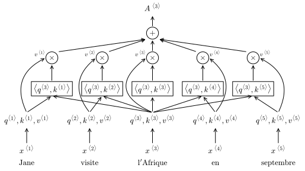
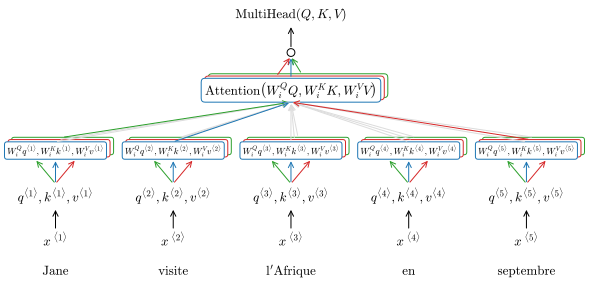
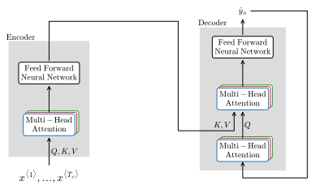
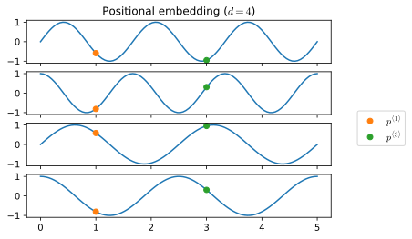
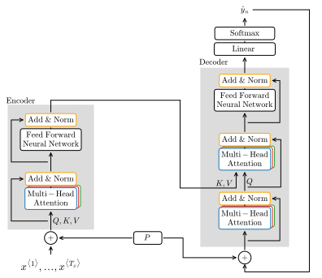

# Transformer network
One of the most powerful new idea in deep learning are the **transformer networks**, sometimes called **transformers**, an architecture presented in [Vaswani et.al.2017](https://arxiv.org/abs/1706.03762) that has mostly taken over in NLP.

The complexity of architectures increase with the complexity of tasks. RNNs have problems with long-range dependencies and so, GRUs and LSTMs address those issues at the cost of an increased complexity.

RNNs, GRUs and LSTMs are **sequential**, meaning that in order to process information at time step $t$, you necessarily have to process all preceding time steps $t^{\langle 0 \rangle}, \dots, t^{\langle t-1 \rangle}$. Transformers address this problem by introducing **parallelization**, so that a sequence is injested all at the same time rather than one step at a time.

Transformers combine the Attention model with CNNs and are based on two main processes:

* **Self-Attention** produces attention based representations $A^{\langle t \rangle}$ for all elements in a sequence
* **Multi-Head Attention** repeats the self-attention process generating multiple versions of the time-steps representations

## Self-Attention
Suppose we have a machine translation task and the input sentence

```
Jane visite l'Afrique en septembre
```

The self-attention mechanism builds an attention-based vector representation for each word in the input sentence $A^{\langle t \rangle}$. Each of these representations is a **context-dependent embedding** of a word and they are all computed in parallel. A self-attention representation $A^{\langle t \rangle}$ is computed as

$$
A(q, K, V) = \sum_i \frac{\exp \left( q \cdot k^{\langle i \rangle}\right)}
{\sum_j \exp \left( q \cdot k ^{\langle j \rangle} \right) }v^{\langle i \rangle}
$$

where $q^{\langle t \rangle}, k^{\langle t \rangle}, v^{\langle t \rangle}$, called the **query**, **key** and **value**, are vectors that are used as input to compute the self-attention representation for each word. These vectors are named using a loose analogy the queries and key-value pairs concepts in databases.

Let's build the self-attention representation for the third word $A^{\langle 3 \rangle}$ `l'Afrique` (<a href="#fig:selfattention">figure below</a>)

1. Each word is associated with its query, key, and value vectors, which are defined as
    
    $$
    \begin{equation}
    \begin{split}
    &q^{\langle 3 \rangle}=W^Qx^{\langle 3 \rangle}\\
    &k^{\langle 3 \rangle}=W^Kx^{\langle 3 \rangle}\\
    &v^{\langle 3 \rangle}=W^Vx^{\langle 3 \rangle}
    \end{split}
    \end{equation}
    \label{eq:qkv} \tag{1}
    $$

    where $W^Q, W^K, W^V$ are learned parameter matrices of the algorithm. The query vector $q^{\langle 3 \rangle}$ represents a question about word $x^{\langle 3 \rangle}$ (`l'Afrique`). For example, it may represent the question "*what's happening there?*"

2. The inner product of $q^{\langle 3 \rangle}$ with the key vector of each word $K$ is computed. Each of these inner products tells how good is $x^{\langle t \rangle}$ as an answer to $q^{\langle 3 \rangle}$. For intuition purpose if $k^{\langle 1 \rangle}$ represents a *person* (`Jane`) and $k^{\langle 2 \rangle}$ represents an *action* (`visite`), then you may find that $\left \langle q^{\langle 3 \rangle}, k^{\langle 2 \rangle} \right \rangle$ has the largest value and that `visite` gives the most relevant context to *what is happening in Africa*. Since this step is computing the inner product, it is actually scanning for the key $k$ vector, which is **most similar to the query** vector $q$.

3. The softmax of all the inner products $\left \langle q^{\langle 3 \rangle}, k^{\langle j \rangle} \right \rangle$ is computed

4. The softmax vector is multiplied with the value vector $V$

5. By summing over all values of vector $V$, we obtain $A^{\langle 3 \rangle}$, which can be also written as 

$$
A^{\langle 3 \rangle } = A \left( q^{\langle 3 \rangle }, K, V\right) 
$$


    

    


<i id="fig:selfattention">Self attention mechanism for the computation of the self-attention representation $A^{\langle 3 \rangle}$. A set of query, key, value vectors ($q, k, v$) are learned for each word $x$. The best context-dependent embedding is computed for the word $x^{\langle 3 \rangle}$ as the inner product of query and key $\langle q, k \rangle$. The softmax vector of the inner products is multiplied by the value vector $v$, which summed together constitutes the self-attention representation $A^{\langle 3 \rangle}$ </i>


The main advantage of the self-attention mechanism is that the embedding for the word `l'Afrique` is not fixed. The self-attention mechanism realizes that `l'Afrique` is the destination of a `visite` and thus compute a more useful and context-aware representation for this word.
    
This process is repeated for each word in the sequence to obtain self-attention representations for each of them $A^{\langle i \rangle}$, which in literature is often defined in a vectorized notation
    
$$
\text{Attention}(Q,K,V) = \text{softmax} \left ( \frac{QK^T}{\sqrt{d_k}} \right)V
$$
    
where $\sqrt{d_k}$ is the **scaled dot product** used to prevent exploding gradients, and in fact another name for this model is the **scaled dot product attention** as it is presented in the original transformer architecture paper ([Vaswani et.al.2017](https://arxiv.org/abs/1706.03762))

## Multi-Head attention
The multi-head attention is a **layer** of the transformer architecture. A multi-head attention layer repeats the self attention mechanism multiple times **in parallel**. Each time we calculate self attention for a sequence it's called a **head**, thus the name multi-head attention. 

Self attention vectors are functions of $q, k, v$ vectors. In turn these vectors are obtained as defined in $\eqref{eq:qkv}$ and they are a function of the parameter matrices $W^Q, W^K, W^V$.

The parameters matrices of the first head, to which refer as $W_1^Q, W_1^K, W_1^V$ focus on asking and answering a specific question; in the example above we said that the question asked when computing $A^{\langle 3 \rangle }$ is: *What is happening there?*.

When computing the second head we will have a second set of parameter matrices $W_2^Q, W_2^K, W_2^V$, which are relative to a different question, for example it could be: *When?* , and so the largest inner product may now be $\langle q^{\langle 3 \rangle }, k^{\langle 5 \rangle } \rangle$

There will be as many heads as the number of questions asked and the number of heads is usually referred to as $h$, with a typical number of heads being 8.

The final value of the multi-head process is the concatenation of all the heads, multiplied by a parameter matrix $W_o$

$$
\text{MultiHead}(Q, K, V)=\text{concat}\left(\text{head}_1, \dots \text{head_h}\right)W_o
$$


    

    


<i id="fig:multihead">Processing of multiple heads (self-attention mechanisms). Multiple context-dependent embeddings (self-attention representations or heads) are computed in parallel to answer different queries $q$. The heads are then concatenated in the final output</i>

The different heads are independent computations and can thus be calculated **in parallel**; after the computation of all the heads is completed, the self-attention vectors are concatenated and multiplied by a parameter matrix $W_o$.

## Transformer network
A transformer is made of an **encoder block** and a **decoder block**, each repeated $N$ times (with a typical value being $N=6$). The encoder block produces an encoding of the input sequence, the decoder block maps the encoding to an output sequence.

### Encoder Decoder blocks
The encoder block has a multi-head attention layer, which is fed the vectors $Q, K, V$ computed for the input sequence. The multi-head attention layer produces a matrix that is passed into a feed-forward neural network, which is the second layer of the encoder block. After repeating $N$ times the encoder feeds the results in the decoder block (<a href="#fig:transbase">figure below</a>).

At each time-step $t$ the decoder blocks is fed $[1:t]$ elements from the input sequence. These elements are fed into a multi-head attention layer, whose job is to generate the query matrix $Q$ for the next multi-head attention layer. The key-value pair matrices $K, V$ taken as input in this second multi-head attention layer are instead generated from the output of the encoder.
This architecture is designed to produce an optimal next word, given the previous words in the translation (the $[1:t]$ elements fed as $Q$) and the input sequence (encoding fed as $K, V$). The second multi-head attention layer feeds into a feed forward neural network producing an output matrix, which is fed in loop to the decoder block for $N$ times.


    

    


<i id="fig:transbase">Simplified representation of a transformer network focusing on the encoder and decoder blocks and their main components</i>

### Positional encoding and skip-connections
In the self-attention model we didn't talk about any encoding of the position of an element in the sequence. However, position is a fundamental piece of information when treating with sequences. 

In Transformers a **positional-embedding** vector $P$ of the same dimension $d$ of the self-attention embedding vector is function of the numerical position of an element in the sequence ($\small\text{pos}$), $P$ and $d$ (<a href="#fig:posenc">figure below</a>).

$$
\begin{split}
P(\small\text{pos}, 2t) &= \sin \left( \frac{\small\text{pos}}{10000^{\frac{2t}{d}}} \right) \\
P(\small\text{pos}, 2t+1)& = \cos \left( \frac{\small\text{pos}}{10000^{\frac{2t}{d}}} \right)
\end{split}
$$


    

    


<i id="fig:posenc">Positional embedding $P$ of dimension $d=4$ for elements with positions $\text{pos}=1$ (orange points) and $\text{pos}=3$ (green points) in a sequence</i>

The positional embedding is directly added to the encoder and decoder blocks of the transformer. The information of the positional embedding is then propagated throughout the whole network via **skip-connections**. Skip connections are directed to **normalization layers** placed after each multi-head and feed-forward layer in both encoder and decoder blocks. This normalization layers are called **Add & Norm** layers. Finally, the decoder block feeds to a linear and softmax layer that produce the final output (<a href="#transfarch">figure below</a>).  


    

    


<i id="fig:transfarch">Full transformer architecture with encoder and decoder blocks, positional embeddings, skip connections, normalization and final linear and softmax layers</i>
